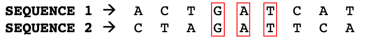
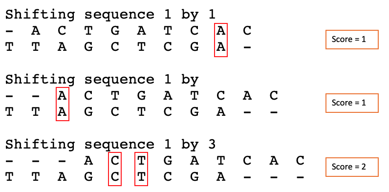
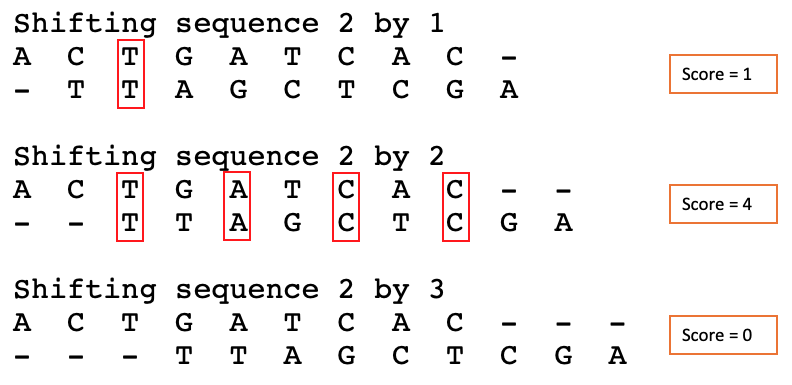

# INF 502 - PA1
Programming Assignment 1 for INF 502.

**DUE DATE:** OCT-08


This assignment will give you some practice with basic Python structures, file input and output, 
and exceptions in the context of writing a basic program. 

I hope you enjoy dealing with the assignment. We will deal with two dummy problems in this assignment, which you will have discuss at the end.

## DNA Similarity
Measuring the similarity betweenn different sequences of DNA may tell us how related the owners of those sequences are. 

A molecule of DNA consists of two chains made up of repeating subunits called nucleotides. There are four different types of nucleotides in DNA: adenine (A), thymine (T), guanine (G), and cytosine (C) [1]. Programmatically, DNA we can have represent it as a string, where each character must be one of A, G, C, or T.

To measure similarity, from my extensive background in Biology, **I just created (made up)** two nice and simple metrics to do so.

**NUMBER OF MATCHES:** for the first one, we will compare the alignment between two sequences of DNA checking each position. Most probably there are better ways of assessing DNA similarity, but we will use this as a case for our programming assignment. 
By aligning the sequences pairwise, we will see the number of matches, for example:



In the case of the figure we have three matches (highlighted in red). The **score is 3**.

However, one thing to have in mind is that each sequence may have insertions or deletions to form a better alignment (but we cannot reorder any sequence). In other words, we can shift nucleotides as long as the order is the same. **For this assignment we will only attempt to shift the complete sequence, without considering insertions or deletions in the middle of the sequence.** By shifting a sequence by one it is possible to verify if we get better results than other previous configurations. The maximum shift (number of insertions in the beginning of a sequence) may be either explicitly set by the user or left to the algorithm to decide when it is not possible to get a better score.  For example, if the user considers a maximum shift of 3, these will be the possibilities:




In this case, as it is possible to see, by shifting the Sequence 2 by 2, we have the highest score (4). And the sequences after shifts are:
```
SEQUENCE 1 -> A  C  T  G  A  T  C  A  C  -  -
SEQUENCE 2 -> -  -  T  T  A  G  C  T  C  G  A
```

**MAXIMUM CONTIGUOUS CHAIN:** In this case we will analyze the sequences following the same pairwise comparison. However, instead we will try to search the highest number of contiguous nucleotides. In the example above, the maximum score occurs when we shift the sequence 1 by 3 (with a contiguous chain with 2 characters). 

## Assignment: Implementing the Similarity algorithm described above
 
You can decompose the algorithm into functions however you like, and it would be really beneficial to you if you spent some time planning out what that decomposition should look like. Your program has to fulfill the following requirements:

* Number of matches: Your code must be able to calculate the maximum score and print the shifted strings in the output
* Maximum chain: Your code must be able to calculate the size of the maximum contiguous chain that matches the sequences (score) and the sequences that resulted on that score (shifted)
* User-input: Your program must collect from the user the following information: the maximum shift; the approach to be used (number of matches or maximum chain), the name of the input files (each sequence needs to be provided inside of a file)
* File input: Your code must use file input to read the DNA sequences (one sequence per file)
* Exception handling: Your code must handle all exception types raised, and do so by accounting for specific exception types (in other words, no except: or except Exception: clauses).
* Important: the sequences must have the same length.

Do some examples on paper first, before you start coding.

I would suggest you attack the problem in a phased manner: First start by getting the similarity functions (one at a time) working correctly, and test them using string literals. Then, add the file input capability. Then, add the interactive elements, to gather parameters from the user. Finally, add your exception handling using try/except blocks and test your system thoroughly to make sure you're catching all exceptions that can be raised by your code. Do your best to make the interactive elements of the program look aesthetically pleasing.


Submission

You'll create a markdown file on your GitHub repository (private, inviting me): First, provide a short description of your solution approach to implementing the algorithm. Then list your source code, and the result of at least one example per approach, along with the contents of the files used. Finally, discuss the the hurdles and benefits of developing each approach, and how did you handle them (I'd suggest to keep track of this in a diary-based approach).


1. http://knowgenetics.org/dna-and-proteins/
