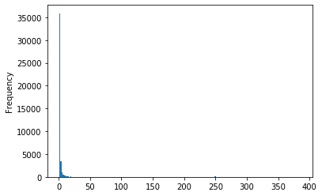
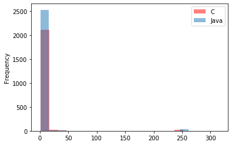
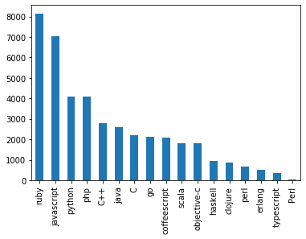
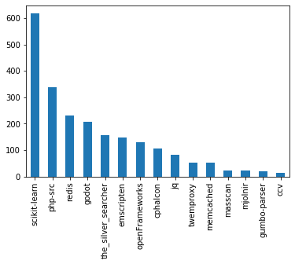
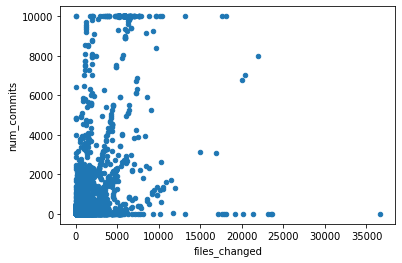
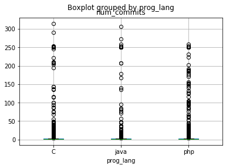
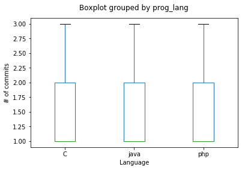

## Exploring data using Pandas


So far we explored Python and a few native libraries. Now we will play a little to simplify our life with tools to conduct some **data analysis**.

**Pandas** is the most popular library (so far) to import and handle data in Python.

### Let's import some data from a CSV file

**When downloading my ipynb, remember to also get the `commits_pr.csv` file**


```python
import pandas
cpr = pandas.read_csv("commits_pr.csv")
```

It became this easy to read a CSV file!!!
And more... Look at what my `cpr` is:


```python
type(cpr)
```


    pandas.core.frame.DataFrame


Yes! A DataFrame. And it reads really nice, look:


```python
cpr.tail()
### We can use head() and tail() functions to see a bit less
```


<div>
<style scoped>
    .dataframe tbody tr th:only-of-type {
        vertical-align: middle;
    }

    .dataframe tbody tr th {
        vertical-align: top;
    }

    .dataframe thead th {
        text-align: right;
    }
</style>
<table border="1" class="dataframe">
  <thead>
    <tr style="text-align: right;">
      <th></th>
      <th>user</th>
      <th>project_name</th>
      <th>prog_lang</th>
      <th>pull_req_number</th>
      <th>num_commits</th>
    </tr>
  </thead>
  <tbody>
    <tr>
      <th>42087</th>
      <td>user36933</td>
      <td>node</td>
      <td>javascript</td>
      <td>14285</td>
      <td>1</td>
    </tr>
    <tr>
      <th>42088</th>
      <td>user36934</td>
      <td>react</td>
      <td>javascript</td>
      <td>8762</td>
      <td>2</td>
    </tr>
    <tr>
      <th>42089</th>
      <td>user36934</td>
      <td>rails</td>
      <td>ruby</td>
      <td>27508</td>
      <td>1</td>
    </tr>
    <tr>
      <th>42090</th>
      <td>user36935</td>
      <td>cocos2d-x</td>
      <td>C++</td>
      <td>15047</td>
      <td>1</td>
    </tr>
    <tr>
      <th>42091</th>
      <td>user36936</td>
      <td>node</td>
      <td>javascript</td>
      <td>9508</td>
      <td>2</td>
    </tr>
  </tbody>
</table>
</div>


Before moving forward... Explaining a little about this dataset.

This dataset represents a series of Pull Requests made to a subset of projects hosted by GitHub. We worked on this data to capture a specific type of contributor, which we called *casual contributor*. These contributors are known by having a single pull request accepted in a project and not coming back (i.e., they have no long-term commitment to the project).

In this specific dataset, you will find the following columns:

* `user`: represent a user in GitHub (anonymized here)
* `project_name`: the name of GitHub project in which the pull request was accepted
* `prog_lang`: programming language of the project
* `pull_req_num`: unique identifier of the pull request
* `num_commits`: number of commits sent within that specific pull request


### Some information about the dataframe

Dimensions/shape of the dataset (lines vs. columns)


```python
cpr.shape
```


    (42092, 5)


What about the column names?


```python
cpr.columns
```


    Index(['user', 'project_name', 'prog_lang', 'pull_req_number', 'num_commits'], dtype='object')


And the datatype per column?


```python
cpr.dtypes
```


    user               object
    project_name       object
    prog_lang          object
    pull_req_number     int64
    num_commits         int64
    dtype: object


Some more information: `info()` method prints information including the index dtype and column dtypes, non-null values and memory usage.


```python
cpr.info()
```

    <class 'pandas.core.frame.DataFrame'>
    RangeIndex: 42092 entries, 0 to 42091
    Data columns (total 5 columns):
    user               42092 non-null object
    project_name       42092 non-null object
    prog_lang          42092 non-null object
    pull_req_number    42092 non-null int64
    num_commits        42092 non-null int64
    dtypes: int64(2), object(3)
    memory usage: 1.6+ MB


What is the type of a specific column???


```python
type(cpr["num_commits"])
```


    pandas.core.series.Series


A *serie* is a list, with one dimension, indexed. Each column of a dataframe is a series

Before moving ahead, we can use the types to filter some columns. 

Let's say we want only the columns that store `int`:


```python
int_columns = cpr.dtypes[cpr.dtypes == "int64"].index
int_columns
```


    Index(['pull_req_number', 'num_commits'], dtype='object')


Now... I just want to see these columns... **BOOM**


```python
cpr[int_columns].head()
```


<div>
<style scoped>
    .dataframe tbody tr th:only-of-type {
        vertical-align: middle;
    }

    .dataframe tbody tr th {
        vertical-align: top;
    }

    .dataframe thead th {
        text-align: right;
    }
</style>
<table border="1" class="dataframe">
  <thead>
    <tr style="text-align: right;">
      <th></th>
      <th>pull_req_number</th>
      <th>num_commits</th>
    </tr>
  </thead>
  <tbody>
    <tr>
      <th>0</th>
      <td>122</td>
      <td>1</td>
    </tr>
    <tr>
      <th>1</th>
      <td>3325</td>
      <td>1</td>
    </tr>
    <tr>
      <th>2</th>
      <td>2128</td>
      <td>2</td>
    </tr>
    <tr>
      <th>3</th>
      <td>2663</td>
      <td>1</td>
    </tr>
    <tr>
      <th>4</th>
      <td>7901</td>
      <td>1</td>
    </tr>
  </tbody>
</table>
</div>


### What about statistical information about my DataFrame?

`describe()` method provides a summary of numeric values in your dataset: mean, standard deviation, minimum, maximum, 1st quartile, 2nd quartile (median), 3rd quartile of the columns with numeric values. It also counts the number of variables in the dataset (are there missing variables?)


```python
cpr.describe()
```


<div>
<style scoped>
    .dataframe tbody tr th:only-of-type {
        vertical-align: middle;
    }

    .dataframe tbody tr th {
        vertical-align: top;
    }

    .dataframe thead th {
        text-align: right;
    }
</style>
<table border="1" class="dataframe">
  <thead>
    <tr style="text-align: right;">
      <th></th>
      <th>pull_req_number</th>
      <th>num_commits</th>
    </tr>
  </thead>
  <tbody>
    <tr>
      <th>count</th>
      <td>42092.000000</td>
      <td>42092.000000</td>
    </tr>
    <tr>
      <th>mean</th>
      <td>4452.145681</td>
      <td>3.824242</td>
    </tr>
    <tr>
      <th>std</th>
      <td>6152.304478</td>
      <td>20.760123</td>
    </tr>
    <tr>
      <th>min</th>
      <td>1.000000</td>
      <td>1.000000</td>
    </tr>
    <tr>
      <th>25%</th>
      <td>628.000000</td>
      <td>1.000000</td>
    </tr>
    <tr>
      <th>50%</th>
      <td>2007.000000</td>
      <td>1.000000</td>
    </tr>
    <tr>
      <th>75%</th>
      <td>5534.250000</td>
      <td>2.000000</td>
    </tr>
    <tr>
      <th>max</th>
      <td>38174.000000</td>
      <td>385.000000</td>
    </tr>
  </tbody>
</table>
</div>


We can do it for a Series...


```python
#cpr["num_commits"].describe()
cpr.num_commits.describe()
```


    count    42092.000000
    mean         3.824242
    std         20.760123
    min          1.000000
    25%          1.000000
    50%          1.000000
    75%          2.000000
    max        385.000000
    Name: num_commits, dtype: float64


```python
#LOOK at this with a non-numeric column
cpr.prog_lang.describe() #either way work.
```


    count     42092
    unique       17
    top        ruby
    freq       8147
    Name: prog_lang, dtype: object


And we can get specific information per column


```python
cpr.num_commits.median()
```


    1.0


```python
cpr.num_commits.mean()
```


    3.8242421362729258


```python
cpr.num_commits.std()
```


    20.76012335707578


### --------------####
### Playing with the data: sorting

We can sort our data easily using pandas.

In this example, sorting by Programming Language


```python
cpr.sort_values("num_commits", ascending=False).head(10)
```


<div>
<style scoped>
    .dataframe tbody tr th:only-of-type {
        vertical-align: middle;
    }

    .dataframe tbody tr th {
        vertical-align: top;
    }

    .dataframe thead th {
        text-align: right;
    }
</style>
<table border="1" class="dataframe">
  <thead>
    <tr style="text-align: right;">
      <th></th>
      <th>user</th>
      <th>project_name</th>
      <th>prog_lang</th>
      <th>pull_req_number</th>
      <th>num_commits</th>
    </tr>
  </thead>
  <tbody>
    <tr>
      <th>38987</th>
      <td>user34165</td>
      <td>three.js</td>
      <td>javascript</td>
      <td>7832</td>
      <td>385</td>
    </tr>
    <tr>
      <th>705</th>
      <td>user640</td>
      <td>cocos2d-x</td>
      <td>C++</td>
      <td>6866</td>
      <td>364</td>
    </tr>
    <tr>
      <th>7335</th>
      <td>user6426</td>
      <td>redis</td>
      <td>C</td>
      <td>3506</td>
      <td>315</td>
    </tr>
    <tr>
      <th>19587</th>
      <td>user17126</td>
      <td>jenkins</td>
      <td>java</td>
      <td>2718</td>
      <td>307</td>
    </tr>
    <tr>
      <th>35826</th>
      <td>user31347</td>
      <td>redis</td>
      <td>C</td>
      <td>3230</td>
      <td>290</td>
    </tr>
    <tr>
      <th>13300</th>
      <td>user11672</td>
      <td>cocos2d-x</td>
      <td>C++</td>
      <td>16576</td>
      <td>281</td>
    </tr>
    <tr>
      <th>3601</th>
      <td>user3214</td>
      <td>three.js</td>
      <td>javascript</td>
      <td>7808</td>
      <td>277</td>
    </tr>
    <tr>
      <th>13873</th>
      <td>user12167</td>
      <td>spring-framework</td>
      <td>java</td>
      <td>642</td>
      <td>273</td>
    </tr>
    <tr>
      <th>26360</th>
      <td>user23077</td>
      <td>Faker</td>
      <td>php</td>
      <td>660</td>
      <td>259</td>
    </tr>
    <tr>
      <th>18632</th>
      <td>user16293</td>
      <td>libgdx</td>
      <td>java</td>
      <td>814</td>
      <td>258</td>
    </tr>
  </tbody>
</table>
</div>


We can sort using *many columns*, by using a list (sort will happen from the first item to the last)


```python
cpr.sort_values(["prog_lang", "project_name", "num_commits"], ascending=False).head(10)
```


<div>
<style scoped>
    .dataframe tbody tr th:only-of-type {
        vertical-align: middle;
    }

    .dataframe tbody tr th {
        vertical-align: top;
    }

    .dataframe thead th {
        text-align: right;
    }
</style>
<table border="1" class="dataframe">
  <thead>
    <tr style="text-align: right;">
      <th></th>
      <th>user</th>
      <th>project_name</th>
      <th>prog_lang</th>
      <th>pull_req_number</th>
      <th>num_commits</th>
    </tr>
  </thead>
  <tbody>
    <tr>
      <th>14351</th>
      <td>user12556</td>
      <td>winjs</td>
      <td>typescript</td>
      <td>678</td>
      <td>11</td>
    </tr>
    <tr>
      <th>40943</th>
      <td>user35906</td>
      <td>winjs</td>
      <td>typescript</td>
      <td>1609</td>
      <td>10</td>
    </tr>
    <tr>
      <th>35890</th>
      <td>user31404</td>
      <td>winjs</td>
      <td>typescript</td>
      <td>565</td>
      <td>6</td>
    </tr>
    <tr>
      <th>1800</th>
      <td>user1614</td>
      <td>winjs</td>
      <td>typescript</td>
      <td>1179</td>
      <td>3</td>
    </tr>
    <tr>
      <th>20245</th>
      <td>user17684</td>
      <td>winjs</td>
      <td>typescript</td>
      <td>1559</td>
      <td>3</td>
    </tr>
    <tr>
      <th>29167</th>
      <td>user25562</td>
      <td>winjs</td>
      <td>typescript</td>
      <td>30</td>
      <td>3</td>
    </tr>
    <tr>
      <th>4780</th>
      <td>user4214</td>
      <td>winjs</td>
      <td>typescript</td>
      <td>44</td>
      <td>2</td>
    </tr>
    <tr>
      <th>5142</th>
      <td>user4533</td>
      <td>winjs</td>
      <td>typescript</td>
      <td>185</td>
      <td>2</td>
    </tr>
    <tr>
      <th>7862</th>
      <td>user6897</td>
      <td>winjs</td>
      <td>typescript</td>
      <td>1515</td>
      <td>2</td>
    </tr>
    <tr>
      <th>32077</th>
      <td>user28045</td>
      <td>winjs</td>
      <td>typescript</td>
      <td>428</td>
      <td>2</td>
    </tr>
  </tbody>
</table>
</div>


```python
cpr.head(10)
```


<div>
<style scoped>
    .dataframe tbody tr th:only-of-type {
        vertical-align: middle;
    }

    .dataframe tbody tr th {
        vertical-align: top;
    }

    .dataframe thead th {
        text-align: right;
    }
</style>
<table border="1" class="dataframe">
  <thead>
    <tr style="text-align: right;">
      <th></th>
      <th>user</th>
      <th>project_name</th>
      <th>prog_lang</th>
      <th>pull_req_number</th>
      <th>num_commits</th>
    </tr>
  </thead>
  <tbody>
    <tr>
      <th>0</th>
      <td>user1</td>
      <td>php-src</td>
      <td>C</td>
      <td>122</td>
      <td>1</td>
    </tr>
    <tr>
      <th>1</th>
      <td>user2</td>
      <td>activeadmin</td>
      <td>ruby</td>
      <td>3325</td>
      <td>1</td>
    </tr>
    <tr>
      <th>2</th>
      <td>user3</td>
      <td>YouCompleteMe</td>
      <td>python</td>
      <td>2128</td>
      <td>2</td>
    </tr>
    <tr>
      <th>3</th>
      <td>user4</td>
      <td>requests</td>
      <td>python</td>
      <td>2663</td>
      <td>1</td>
    </tr>
    <tr>
      <th>4</th>
      <td>user5</td>
      <td>ipython</td>
      <td>python</td>
      <td>7901</td>
      <td>1</td>
    </tr>
    <tr>
      <th>5</th>
      <td>user6</td>
      <td>haste-compiler</td>
      <td>haskell</td>
      <td>407</td>
      <td>1</td>
    </tr>
    <tr>
      <th>6</th>
      <td>user7</td>
      <td>select2</td>
      <td>javascript</td>
      <td>1987</td>
      <td>1</td>
    </tr>
    <tr>
      <th>7</th>
      <td>user8</td>
      <td>django</td>
      <td>python</td>
      <td>8608</td>
      <td>3</td>
    </tr>
    <tr>
      <th>8</th>
      <td>user9</td>
      <td>folly</td>
      <td>C++</td>
      <td>206</td>
      <td>1</td>
    </tr>
    <tr>
      <th>9</th>
      <td>user10</td>
      <td>django</td>
      <td>python</td>
      <td>4745</td>
      <td>2</td>
    </tr>
  </tbody>
</table>
</div>


If you want to keep the sorted version, you can use the parameter `inplace`:


```python
cpr.sort_values(["prog_lang", "project_name", "num_commits"], ascending=False, inplace=True)
```


```python
cpr.head(10)
#cpr = pandas.read_csv("commits_pr.csv") #--> to return to the original order
```


<div>
<style scoped>
    .dataframe tbody tr th:only-of-type {
        vertical-align: middle;
    }

    .dataframe tbody tr th {
        vertical-align: top;
    }

    .dataframe thead th {
        text-align: right;
    }
</style>
<table border="1" class="dataframe">
  <thead>
    <tr style="text-align: right;">
      <th></th>
      <th>user</th>
      <th>project_name</th>
      <th>prog_lang</th>
      <th>pull_req_number</th>
      <th>num_commits</th>
    </tr>
  </thead>
  <tbody>
    <tr>
      <th>14351</th>
      <td>user12556</td>
      <td>winjs</td>
      <td>typescript</td>
      <td>678</td>
      <td>11</td>
    </tr>
    <tr>
      <th>40943</th>
      <td>user35906</td>
      <td>winjs</td>
      <td>typescript</td>
      <td>1609</td>
      <td>10</td>
    </tr>
    <tr>
      <th>35890</th>
      <td>user31404</td>
      <td>winjs</td>
      <td>typescript</td>
      <td>565</td>
      <td>6</td>
    </tr>
    <tr>
      <th>1800</th>
      <td>user1614</td>
      <td>winjs</td>
      <td>typescript</td>
      <td>1179</td>
      <td>3</td>
    </tr>
    <tr>
      <th>20245</th>
      <td>user17684</td>
      <td>winjs</td>
      <td>typescript</td>
      <td>1559</td>
      <td>3</td>
    </tr>
    <tr>
      <th>29167</th>
      <td>user25562</td>
      <td>winjs</td>
      <td>typescript</td>
      <td>30</td>
      <td>3</td>
    </tr>
    <tr>
      <th>4780</th>
      <td>user4214</td>
      <td>winjs</td>
      <td>typescript</td>
      <td>44</td>
      <td>2</td>
    </tr>
    <tr>
      <th>5142</th>
      <td>user4533</td>
      <td>winjs</td>
      <td>typescript</td>
      <td>185</td>
      <td>2</td>
    </tr>
    <tr>
      <th>7862</th>
      <td>user6897</td>
      <td>winjs</td>
      <td>typescript</td>
      <td>1515</td>
      <td>2</td>
    </tr>
    <tr>
      <th>32077</th>
      <td>user28045</td>
      <td>winjs</td>
      <td>typescript</td>
      <td>428</td>
      <td>2</td>
    </tr>
  </tbody>
</table>
</div>


### Counting the occurences of variables

So, to count the occurrences in a column we have to select the column first, and use the method `value_counts()`


```python
cpr.prog_lang.value_counts()
```


    ruby            8147
    javascript      7052
    python          4092
    php             4069
    C++             2785
    java            2596
    C               2196
    go              2103
    coffeescript    2066
    scala           1823
    objective-c     1801
    haskell          950
    clojure          882
    perl             663
    erlang           500
    typescript       343
    Perl              24
    Name: prog_lang, dtype: int64


But... I just want to know what are the languages out there. Is there a way?

*Always*


```python
cpr["prog_lang"].unique()
```


    array(['typescript', 'scala', 'ruby', 'python', 'php', 'perl',
           'objective-c', 'javascript', 'java', 'haskell', 'go', 'erlang',
           'coffeescript', 'clojure', 'Perl', 'C++', 'C'], dtype=object)


## OK! Let's do something else... Like, selecting columns and filtering data

Let's say that I just want to look at the columns programming language, project name and number of commits. 

I can select them and create a new DF


```python
selected_columns = ["prog_lang", "project_name", "num_commits"]
my_subset = cpr[selected_columns]
my_subset.head()
```


<div>
<style scoped>
    .dataframe tbody tr th:only-of-type {
        vertical-align: middle;
    }

    .dataframe tbody tr th {
        vertical-align: top;
    }

    .dataframe thead th {
        text-align: right;
    }
</style>
<table border="1" class="dataframe">
  <thead>
    <tr style="text-align: right;">
      <th></th>
      <th>prog_lang</th>
      <th>project_name</th>
      <th>num_commits</th>
    </tr>
  </thead>
  <tbody>
    <tr>
      <th>14351</th>
      <td>typescript</td>
      <td>winjs</td>
      <td>11</td>
    </tr>
    <tr>
      <th>40943</th>
      <td>typescript</td>
      <td>winjs</td>
      <td>10</td>
    </tr>
    <tr>
      <th>35890</th>
      <td>typescript</td>
      <td>winjs</td>
      <td>6</td>
    </tr>
    <tr>
      <th>1800</th>
      <td>typescript</td>
      <td>winjs</td>
      <td>3</td>
    </tr>
    <tr>
      <th>20245</th>
      <td>typescript</td>
      <td>winjs</td>
      <td>3</td>
    </tr>
  </tbody>
</table>
</div>


What if now I want to filter those projects written in `C` language?


```python
only_C = cpr[(cpr["prog_lang"]=='C') & (cpr["num_commits"]==2)]
only_C.describe()
```


<div>
<style scoped>
    .dataframe tbody tr th:only-of-type {
        vertical-align: middle;
    }

    .dataframe tbody tr th {
        vertical-align: top;
    }

    .dataframe thead th {
        text-align: right;
    }
</style>
<table border="1" class="dataframe">
  <thead>
    <tr style="text-align: right;">
      <th></th>
      <th>pull_req_number</th>
      <th>num_commits</th>
    </tr>
  </thead>
  <tbody>
    <tr>
      <th>count</th>
      <td>389.000000</td>
      <td>389.0</td>
    </tr>
    <tr>
      <th>mean</th>
      <td>3815.380463</td>
      <td>2.0</td>
    </tr>
    <tr>
      <th>std</th>
      <td>3264.957089</td>
      <td>0.0</td>
    </tr>
    <tr>
      <th>min</th>
      <td>3.000000</td>
      <td>2.0</td>
    </tr>
    <tr>
      <th>25%</th>
      <td>1061.000000</td>
      <td>2.0</td>
    </tr>
    <tr>
      <th>50%</th>
      <td>2860.000000</td>
      <td>2.0</td>
    </tr>
    <tr>
      <th>75%</th>
      <td>5831.000000</td>
      <td>2.0</td>
    </tr>
    <tr>
      <th>max</th>
      <td>12724.000000</td>
      <td>2.0</td>
    </tr>
  </tbody>
</table>
</div>


We can filter whatever we want:


```python
single_commit = cpr[cpr["num_commits"] == 1]
```

We can create filters in variables, and use whenever we want, as well


```python
one_commit = cpr["num_commits"]==1
language_C = cpr["prog_lang"]=="C"
multi_commit = cpr["num_commits"]>1
```


```python
cpr[one_commit & language_C].head(10)
```


<div>
<style scoped>
    .dataframe tbody tr th:only-of-type {
        vertical-align: middle;
    }

    .dataframe tbody tr th {
        vertical-align: top;
    }

    .dataframe thead th {
        text-align: right;
    }
</style>
<table border="1" class="dataframe">
  <thead>
    <tr style="text-align: right;">
      <th></th>
      <th>user</th>
      <th>project_name</th>
      <th>prog_lang</th>
      <th>pull_req_number</th>
      <th>num_commits</th>
    </tr>
  </thead>
  <tbody>
    <tr>
      <th>1625</th>
      <td>user1464</td>
      <td>twemproxy</td>
      <td>C</td>
      <td>284</td>
      <td>1</td>
    </tr>
    <tr>
      <th>1696</th>
      <td>user1526</td>
      <td>twemproxy</td>
      <td>C</td>
      <td>224</td>
      <td>1</td>
    </tr>
    <tr>
      <th>2259</th>
      <td>user2025</td>
      <td>twemproxy</td>
      <td>C</td>
      <td>398</td>
      <td>1</td>
    </tr>
    <tr>
      <th>2522</th>
      <td>user2268</td>
      <td>twemproxy</td>
      <td>C</td>
      <td>387</td>
      <td>1</td>
    </tr>
    <tr>
      <th>3210</th>
      <td>user2872</td>
      <td>twemproxy</td>
      <td>C</td>
      <td>311</td>
      <td>1</td>
    </tr>
    <tr>
      <th>3946</th>
      <td>user3515</td>
      <td>twemproxy</td>
      <td>C</td>
      <td>366</td>
      <td>1</td>
    </tr>
    <tr>
      <th>4774</th>
      <td>user4209</td>
      <td>twemproxy</td>
      <td>C</td>
      <td>291</td>
      <td>1</td>
    </tr>
    <tr>
      <th>5802</th>
      <td>user5103</td>
      <td>twemproxy</td>
      <td>C</td>
      <td>3</td>
      <td>1</td>
    </tr>
    <tr>
      <th>7326</th>
      <td>user6419</td>
      <td>twemproxy</td>
      <td>C</td>
      <td>58</td>
      <td>1</td>
    </tr>
    <tr>
      <th>7811</th>
      <td>user6850</td>
      <td>twemproxy</td>
      <td>C</td>
      <td>217</td>
      <td>1</td>
    </tr>
  </tbody>
</table>
</div>


And... we can use OR (|) and AND(&) to play!


```python
cpr[one_commit & language_C].head(10)
```


<div>
<style scoped>
    .dataframe tbody tr th:only-of-type {
        vertical-align: middle;
    }

    .dataframe tbody tr th {
        vertical-align: top;
    }

    .dataframe thead th {
        text-align: right;
    }
</style>
<table border="1" class="dataframe">
  <thead>
    <tr style="text-align: right;">
      <th></th>
      <th>user</th>
      <th>project_name</th>
      <th>prog_lang</th>
      <th>pull_req_number</th>
      <th>num_commits</th>
    </tr>
  </thead>
  <tbody>
    <tr>
      <th>1625</th>
      <td>user1464</td>
      <td>twemproxy</td>
      <td>C</td>
      <td>284</td>
      <td>1</td>
    </tr>
    <tr>
      <th>1696</th>
      <td>user1526</td>
      <td>twemproxy</td>
      <td>C</td>
      <td>224</td>
      <td>1</td>
    </tr>
    <tr>
      <th>2259</th>
      <td>user2025</td>
      <td>twemproxy</td>
      <td>C</td>
      <td>398</td>
      <td>1</td>
    </tr>
    <tr>
      <th>2522</th>
      <td>user2268</td>
      <td>twemproxy</td>
      <td>C</td>
      <td>387</td>
      <td>1</td>
    </tr>
    <tr>
      <th>3210</th>
      <td>user2872</td>
      <td>twemproxy</td>
      <td>C</td>
      <td>311</td>
      <td>1</td>
    </tr>
    <tr>
      <th>3946</th>
      <td>user3515</td>
      <td>twemproxy</td>
      <td>C</td>
      <td>366</td>
      <td>1</td>
    </tr>
    <tr>
      <th>4774</th>
      <td>user4209</td>
      <td>twemproxy</td>
      <td>C</td>
      <td>291</td>
      <td>1</td>
    </tr>
    <tr>
      <th>5802</th>
      <td>user5103</td>
      <td>twemproxy</td>
      <td>C</td>
      <td>3</td>
      <td>1</td>
    </tr>
    <tr>
      <th>7326</th>
      <td>user6419</td>
      <td>twemproxy</td>
      <td>C</td>
      <td>58</td>
      <td>1</td>
    </tr>
    <tr>
      <th>7811</th>
      <td>user6850</td>
      <td>twemproxy</td>
      <td>C</td>
      <td>217</td>
      <td>1</td>
    </tr>
  </tbody>
</table>
</div>


#### What if we want the pull requests with more than one commit for the projects written in "C" and those with 2 commits for the projects written in "typescript"???

Let's do it!


```python
#####
two_commits = cpr["num_commits"]==2
language_typescript = cpr["prog_lang"]=="typescript"

cpr[(one_commit & language_C) | (two_commits & language_typescript)]

```


<div>
<style scoped>
    .dataframe tbody tr th:only-of-type {
        vertical-align: middle;
    }

    .dataframe tbody tr th {
        vertical-align: top;
    }

    .dataframe thead th {
        text-align: right;
    }
</style>
<table border="1" class="dataframe">
  <thead>
    <tr style="text-align: right;">
      <th></th>
      <th>user</th>
      <th>project_name</th>
      <th>prog_lang</th>
      <th>pull_req_number</th>
      <th>num_commits</th>
    </tr>
  </thead>
  <tbody>
    <tr>
      <th>4780</th>
      <td>user4214</td>
      <td>winjs</td>
      <td>typescript</td>
      <td>44</td>
      <td>2</td>
    </tr>
    <tr>
      <th>5142</th>
      <td>user4533</td>
      <td>winjs</td>
      <td>typescript</td>
      <td>185</td>
      <td>2</td>
    </tr>
    <tr>
      <th>7862</th>
      <td>user6897</td>
      <td>winjs</td>
      <td>typescript</td>
      <td>1515</td>
      <td>2</td>
    </tr>
    <tr>
      <th>32077</th>
      <td>user28045</td>
      <td>winjs</td>
      <td>typescript</td>
      <td>428</td>
      <td>2</td>
    </tr>
    <tr>
      <th>14874</th>
      <td>user13017</td>
      <td>typescript-node-definitions</td>
      <td>typescript</td>
      <td>10</td>
      <td>2</td>
    </tr>
    <tr>
      <th>4628</th>
      <td>user4086</td>
      <td>tsd</td>
      <td>typescript</td>
      <td>251</td>
      <td>2</td>
    </tr>
    <tr>
      <th>6163</th>
      <td>user5410</td>
      <td>tsd</td>
      <td>typescript</td>
      <td>99</td>
      <td>2</td>
    </tr>
    <tr>
      <th>19480</th>
      <td>user17042</td>
      <td>tsd</td>
      <td>typescript</td>
      <td>227</td>
      <td>2</td>
    </tr>
    <tr>
      <th>28014</th>
      <td>user24539</td>
      <td>tsd</td>
      <td>typescript</td>
      <td>223</td>
      <td>2</td>
    </tr>
    <tr>
      <th>2938</th>
      <td>user2628</td>
      <td>shumway</td>
      <td>typescript</td>
      <td>1660</td>
      <td>2</td>
    </tr>
    <tr>
      <th>29652</th>
      <td>user25959</td>
      <td>shumway</td>
      <td>typescript</td>
      <td>7</td>
      <td>2</td>
    </tr>
    <tr>
      <th>35752</th>
      <td>user31281</td>
      <td>shumway</td>
      <td>typescript</td>
      <td>2156</td>
      <td>2</td>
    </tr>
    <tr>
      <th>39930</th>
      <td>user35002</td>
      <td>shumway</td>
      <td>typescript</td>
      <td>119</td>
      <td>2</td>
    </tr>
    <tr>
      <th>12063</th>
      <td>user10592</td>
      <td>reddcoin</td>
      <td>typescript</td>
      <td>8</td>
      <td>2</td>
    </tr>
    <tr>
      <th>24217</th>
      <td>user21197</td>
      <td>reddcoin</td>
      <td>typescript</td>
      <td>80</td>
      <td>2</td>
    </tr>
    <tr>
      <th>18678</th>
      <td>user16336</td>
      <td>primecoin</td>
      <td>typescript</td>
      <td>15</td>
      <td>2</td>
    </tr>
    <tr>
      <th>37326</th>
      <td>user32674</td>
      <td>primecoin</td>
      <td>typescript</td>
      <td>4</td>
      <td>2</td>
    </tr>
    <tr>
      <th>3309</th>
      <td>user2954</td>
      <td>litecoin</td>
      <td>typescript</td>
      <td>373</td>
      <td>2</td>
    </tr>
    <tr>
      <th>8441</th>
      <td>user7412</td>
      <td>litecoin</td>
      <td>typescript</td>
      <td>356</td>
      <td>2</td>
    </tr>
    <tr>
      <th>12193</th>
      <td>user10705</td>
      <td>litecoin</td>
      <td>typescript</td>
      <td>3</td>
      <td>2</td>
    </tr>
    <tr>
      <th>14382</th>
      <td>user12584</td>
      <td>litecoin</td>
      <td>typescript</td>
      <td>16</td>
      <td>2</td>
    </tr>
    <tr>
      <th>14478</th>
      <td>user12666</td>
      <td>litecoin</td>
      <td>typescript</td>
      <td>2</td>
      <td>2</td>
    </tr>
    <tr>
      <th>34893</th>
      <td>user30521</td>
      <td>litecoin</td>
      <td>typescript</td>
      <td>124</td>
      <td>2</td>
    </tr>
    <tr>
      <th>41348</th>
      <td>user36268</td>
      <td>litecoin</td>
      <td>typescript</td>
      <td>242</td>
      <td>2</td>
    </tr>
    <tr>
      <th>18750</th>
      <td>user16399</td>
      <td>egret-core</td>
      <td>typescript</td>
      <td>125</td>
      <td>2</td>
    </tr>
    <tr>
      <th>15621</th>
      <td>user13681</td>
      <td>doppio</td>
      <td>typescript</td>
      <td>415</td>
      <td>2</td>
    </tr>
    <tr>
      <th>29010</th>
      <td>user25413</td>
      <td>doppio</td>
      <td>typescript</td>
      <td>417</td>
      <td>2</td>
    </tr>
    <tr>
      <th>41824</th>
      <td>user36687</td>
      <td>doppio</td>
      <td>typescript</td>
      <td>387</td>
      <td>2</td>
    </tr>
    <tr>
      <th>430</th>
      <td>user398</td>
      <td>TypeScript</td>
      <td>typescript</td>
      <td>8394</td>
      <td>2</td>
    </tr>
    <tr>
      <th>2542</th>
      <td>user2286</td>
      <td>TypeScript</td>
      <td>typescript</td>
      <td>13045</td>
      <td>2</td>
    </tr>
    <tr>
      <th>...</th>
      <td>...</td>
      <td>...</td>
      <td>...</td>
      <td>...</td>
      <td>...</td>
    </tr>
    <tr>
      <th>25269</th>
      <td>user22129</td>
      <td>cphalcon</td>
      <td>C</td>
      <td>11147</td>
      <td>1</td>
    </tr>
    <tr>
      <th>26031</th>
      <td>user22791</td>
      <td>cphalcon</td>
      <td>C</td>
      <td>11144</td>
      <td>1</td>
    </tr>
    <tr>
      <th>26174</th>
      <td>user22918</td>
      <td>cphalcon</td>
      <td>C</td>
      <td>3192</td>
      <td>1</td>
    </tr>
    <tr>
      <th>26259</th>
      <td>user22997</td>
      <td>cphalcon</td>
      <td>C</td>
      <td>12609</td>
      <td>1</td>
    </tr>
    <tr>
      <th>26272</th>
      <td>user23006</td>
      <td>cphalcon</td>
      <td>C</td>
      <td>2455</td>
      <td>1</td>
    </tr>
    <tr>
      <th>26445</th>
      <td>user23156</td>
      <td>cphalcon</td>
      <td>C</td>
      <td>11214</td>
      <td>1</td>
    </tr>
    <tr>
      <th>27626</th>
      <td>user24204</td>
      <td>cphalcon</td>
      <td>C</td>
      <td>11951</td>
      <td>1</td>
    </tr>
    <tr>
      <th>27992</th>
      <td>user24520</td>
      <td>cphalcon</td>
      <td>C</td>
      <td>2176</td>
      <td>1</td>
    </tr>
    <tr>
      <th>28734</th>
      <td>user25172</td>
      <td>cphalcon</td>
      <td>C</td>
      <td>636</td>
      <td>1</td>
    </tr>
    <tr>
      <th>29569</th>
      <td>user25888</td>
      <td>cphalcon</td>
      <td>C</td>
      <td>10007</td>
      <td>1</td>
    </tr>
    <tr>
      <th>29871</th>
      <td>user26145</td>
      <td>cphalcon</td>
      <td>C</td>
      <td>10802</td>
      <td>1</td>
    </tr>
    <tr>
      <th>30035</th>
      <td>user26276</td>
      <td>cphalcon</td>
      <td>C</td>
      <td>3051</td>
      <td>1</td>
    </tr>
    <tr>
      <th>30057</th>
      <td>user26297</td>
      <td>cphalcon</td>
      <td>C</td>
      <td>12757</td>
      <td>1</td>
    </tr>
    <tr>
      <th>30508</th>
      <td>user26700</td>
      <td>cphalcon</td>
      <td>C</td>
      <td>9927</td>
      <td>1</td>
    </tr>
    <tr>
      <th>30829</th>
      <td>user26967</td>
      <td>cphalcon</td>
      <td>C</td>
      <td>9918</td>
      <td>1</td>
    </tr>
    <tr>
      <th>32633</th>
      <td>user28536</td>
      <td>cphalcon</td>
      <td>C</td>
      <td>1033</td>
      <td>1</td>
    </tr>
    <tr>
      <th>32940</th>
      <td>user28804</td>
      <td>cphalcon</td>
      <td>C</td>
      <td>11983</td>
      <td>1</td>
    </tr>
    <tr>
      <th>33441</th>
      <td>user29243</td>
      <td>cphalcon</td>
      <td>C</td>
      <td>1490</td>
      <td>1</td>
    </tr>
    <tr>
      <th>33795</th>
      <td>user29560</td>
      <td>cphalcon</td>
      <td>C</td>
      <td>2354</td>
      <td>1</td>
    </tr>
    <tr>
      <th>37159</th>
      <td>user32521</td>
      <td>cphalcon</td>
      <td>C</td>
      <td>3340</td>
      <td>1</td>
    </tr>
    <tr>
      <th>39986</th>
      <td>user35049</td>
      <td>cphalcon</td>
      <td>C</td>
      <td>2689</td>
      <td>1</td>
    </tr>
    <tr>
      <th>41069</th>
      <td>user36019</td>
      <td>cphalcon</td>
      <td>C</td>
      <td>11071</td>
      <td>1</td>
    </tr>
    <tr>
      <th>41416</th>
      <td>user36327</td>
      <td>cphalcon</td>
      <td>C</td>
      <td>11148</td>
      <td>1</td>
    </tr>
    <tr>
      <th>41484</th>
      <td>user36386</td>
      <td>cphalcon</td>
      <td>C</td>
      <td>34</td>
      <td>1</td>
    </tr>
    <tr>
      <th>41679</th>
      <td>user36551</td>
      <td>cphalcon</td>
      <td>C</td>
      <td>3082</td>
      <td>1</td>
    </tr>
    <tr>
      <th>2465</th>
      <td>user2213</td>
      <td>ccv</td>
      <td>C</td>
      <td>83</td>
      <td>1</td>
    </tr>
    <tr>
      <th>14883</th>
      <td>user13025</td>
      <td>ccv</td>
      <td>C</td>
      <td>4</td>
      <td>1</td>
    </tr>
    <tr>
      <th>21334</th>
      <td>user18630</td>
      <td>ccv</td>
      <td>C</td>
      <td>19</td>
      <td>1</td>
    </tr>
    <tr>
      <th>21728</th>
      <td>user18978</td>
      <td>ccv</td>
      <td>C</td>
      <td>132</td>
      <td>1</td>
    </tr>
    <tr>
      <th>39827</th>
      <td>user34908</td>
      <td>ccv</td>
      <td>C</td>
      <td>150</td>
      <td>1</td>
    </tr>
  </tbody>
</table>
<p>1367 rows × 5 columns</p>
</div>


What if I wanted to convert number of commits into a feature by creating bands of values that we define:
* 1 commit = group 1
* 2 - 5 commits = group 2
* 6 - 20 commits = group 3
*  more than 20 = group 4


```python
cpr.loc[cpr["num_commits"]==1, "group_commit"]=1
cpr.loc[(cpr["num_commits"]>1) & (cpr["num_commits"]<=5), "group_commit"]=2
cpr.loc[(cpr["num_commits"]>5) & (cpr["num_commits"]<=20), "group_commit"]=3
cpr.loc[cpr["num_commits"]>20, "group_commit"]=4
cpr.group_commit = cpr.group_commit.astype('int32')
```


```python
cpr.head()
```


<div>
<style scoped>
    .dataframe tbody tr th:only-of-type {
        vertical-align: middle;
    }

    .dataframe tbody tr th {
        vertical-align: top;
    }

    .dataframe thead th {
        text-align: right;
    }
</style>
<table border="1" class="dataframe">
  <thead>
    <tr style="text-align: right;">
      <th></th>
      <th>user</th>
      <th>project_name</th>
      <th>prog_lang</th>
      <th>pull_req_number</th>
      <th>num_commits</th>
      <th>group_commit</th>
    </tr>
  </thead>
  <tbody>
    <tr>
      <th>14351</th>
      <td>user12556</td>
      <td>winjs</td>
      <td>typescript</td>
      <td>678</td>
      <td>11</td>
      <td>3</td>
    </tr>
    <tr>
      <th>40943</th>
      <td>user35906</td>
      <td>winjs</td>
      <td>typescript</td>
      <td>1609</td>
      <td>10</td>
      <td>3</td>
    </tr>
    <tr>
      <th>35890</th>
      <td>user31404</td>
      <td>winjs</td>
      <td>typescript</td>
      <td>565</td>
      <td>6</td>
      <td>3</td>
    </tr>
    <tr>
      <th>1800</th>
      <td>user1614</td>
      <td>winjs</td>
      <td>typescript</td>
      <td>1179</td>
      <td>3</td>
      <td>2</td>
    </tr>
    <tr>
      <th>20245</th>
      <td>user17684</td>
      <td>winjs</td>
      <td>typescript</td>
      <td>1559</td>
      <td>3</td>
      <td>2</td>
    </tr>
  </tbody>
</table>
</div>


### I challenge you:

What if: I wanted to know how the average of num_commits for those pull requests in group_commit 4???


```python


```

### I challenge you (2):

Can you do that average per language?


```python
cpr[cpr["prog_lang"] == "typescript"].quantile(0.75)
```


    pull_req_number    8213.5
    num_commits           2.0
    group_commit          2.0
    Name: 0.75, dtype: float64


### Some more... 

Let's work with a new dataset... 

This is not only related to casual contributors, but all contributors


```python
commits_complete = pandas.read_csv('commit_complete.csv')
commits_complete.sort_values('num_commits', ascending=False).head(10)
```


<div>
<style scoped>
    .dataframe tbody tr th:only-of-type {
        vertical-align: middle;
    }

    .dataframe tbody tr th {
        vertical-align: top;
    }

    .dataframe thead th {
        text-align: right;
    }
</style>
<table border="1" class="dataframe">
  <thead>
    <tr style="text-align: right;">
      <th></th>
      <th>user</th>
      <th>project_name</th>
      <th>prog_lang</th>
      <th>num_commits</th>
      <th>additions</th>
      <th>deletions</th>
      <th>files_changed</th>
      <th>num_comments</th>
    </tr>
  </thead>
  <tbody>
    <tr>
      <th>52041</th>
      <td>user_13168</td>
      <td>cocos2d-x</td>
      <td>C++</td>
      <td>10000.0</td>
      <td>1320472.0</td>
      <td>24870.0</td>
      <td>5865.0</td>
      <td>0.0</td>
    </tr>
    <tr>
      <th>52036</th>
      <td>user_13168</td>
      <td>cocos2d-x</td>
      <td>C++</td>
      <td>10000.0</td>
      <td>1321513.0</td>
      <td>24870.0</td>
      <td>5905.0</td>
      <td>0.0</td>
    </tr>
    <tr>
      <th>54883</th>
      <td>user_13227</td>
      <td>cocos2d-x</td>
      <td>C++</td>
      <td>10000.0</td>
      <td>1549480.0</td>
      <td>843841.0</td>
      <td>9726.0</td>
      <td>0.0</td>
    </tr>
    <tr>
      <th>52033</th>
      <td>user_13168</td>
      <td>cocos2d-x</td>
      <td>C++</td>
      <td>10000.0</td>
      <td>1320976.0</td>
      <td>24870.0</td>
      <td>5892.0</td>
      <td>0.0</td>
    </tr>
    <tr>
      <th>61760</th>
      <td>user_13751</td>
      <td>cocos2d-x</td>
      <td>C++</td>
      <td>10000.0</td>
      <td>1163795.0</td>
      <td>24870.0</td>
      <td>5241.0</td>
      <td>0.0</td>
    </tr>
    <tr>
      <th>52034</th>
      <td>user_13168</td>
      <td>cocos2d-x</td>
      <td>C++</td>
      <td>10000.0</td>
      <td>1321296.0</td>
      <td>24870.0</td>
      <td>5905.0</td>
      <td>0.0</td>
    </tr>
    <tr>
      <th>61813</th>
      <td>user_13757</td>
      <td>cocos2d-x</td>
      <td>C++</td>
      <td>10000.0</td>
      <td>1324952.0</td>
      <td>24870.0</td>
      <td>5903.0</td>
      <td>0.0</td>
    </tr>
    <tr>
      <th>52035</th>
      <td>user_13168</td>
      <td>cocos2d-x</td>
      <td>C++</td>
      <td>10000.0</td>
      <td>1321419.0</td>
      <td>24870.0</td>
      <td>5890.0</td>
      <td>0.0</td>
    </tr>
    <tr>
      <th>61841</th>
      <td>user_13764</td>
      <td>cocos2d-x</td>
      <td>C++</td>
      <td>10000.0</td>
      <td>1539898.0</td>
      <td>21568.0</td>
      <td>6574.0</td>
      <td>0.0</td>
    </tr>
    <tr>
      <th>54495</th>
      <td>user_13188</td>
      <td>cocos2d-x</td>
      <td>C++</td>
      <td>10000.0</td>
      <td>1249461.0</td>
      <td>1129333.0</td>
      <td>8848.0</td>
      <td>0.0</td>
    </tr>
  </tbody>
</table>
</div>


```python
commits_complete['num_commits'].corr(commits_complete['additions'])
```


    0.6573205139433453


```python
commits_complete.corr()
```


<div>
<style scoped>
    .dataframe tbody tr th:only-of-type {
        vertical-align: middle;
    }

    .dataframe tbody tr th {
        vertical-align: top;
    }

    .dataframe thead th {
        text-align: right;
    }
</style>
<table border="1" class="dataframe">
  <thead>
    <tr style="text-align: right;">
      <th></th>
      <th>num_commits</th>
      <th>additions</th>
      <th>deletions</th>
      <th>files_changed</th>
      <th>num_comments</th>
    </tr>
  </thead>
  <tbody>
    <tr>
      <th>num_commits</th>
      <td>1.000000</td>
      <td>0.657321</td>
      <td>0.151074</td>
      <td>0.605152</td>
      <td>-0.007297</td>
    </tr>
    <tr>
      <th>additions</th>
      <td>0.657321</td>
      <td>1.000000</td>
      <td>0.244859</td>
      <td>0.749543</td>
      <td>-0.002682</td>
    </tr>
    <tr>
      <th>deletions</th>
      <td>0.151074</td>
      <td>0.244859</td>
      <td>1.000000</td>
      <td>0.566905</td>
      <td>0.011876</td>
    </tr>
    <tr>
      <th>files_changed</th>
      <td>0.605152</td>
      <td>0.749543</td>
      <td>0.566905</td>
      <td>1.000000</td>
      <td>0.003657</td>
    </tr>
    <tr>
      <th>num_comments</th>
      <td>-0.007297</td>
      <td>-0.002682</td>
      <td>0.011876</td>
      <td>0.003657</td>
      <td>1.000000</td>
    </tr>
  </tbody>
</table>
</div>


```python
commits_complete.corr(method='pearson').style.background_gradient(cmap='coolwarm')
```

**Check the result somewhere else**


### Can we play with graphics?

**Plot types:**
- 'line' : line plot (default)
- 'bar' : vertical bar plot
- 'barh' : horizontal bar plot
- 'hist' : histogram
- 'box' : boxplot
- 'kde' : Kernel Density Estimation plot
- 'density' : same as 'kde'
- 'area' : area plot
- 'pie' : pie plot
- 'scatter' : scatter plot
- 'hexbin' : hexbin plot

**Histogram**


```python
cpr.num_commits.plot.hist(bins=200)
```


    <matplotlib.axes._subplots.AxesSubplot at 0x116703e48>





```python
cpr[cpr["prog_lang"]=="C"].num_commits.plot.hist(bins=20, color="red", alpha=0.5)
cpr[cpr["prog_lang"]=="java"].num_commits.plot.hist(bins=20, alpha=0.5).legend(["C", "Java"])
```


    <matplotlib.legend.Legend at 0x113399278>





```python
cpr['prog_lang'].value_counts().plot.bar()
```


    <matplotlib.axes._subplots.AxesSubplot at 0x1134acbe0>





```python
cpr[cpr["prog_lang"]== "C"].project_name.value_counts().plot.bar()
```


    <matplotlib.axes._subplots.AxesSubplot at 0x1135ca390>





```python
commits_complete.plot.scatter(x = "files_changed", y = "num_commits")
```


    <matplotlib.axes._subplots.AxesSubplot at 0x11347bcf8>





```python
lang_c = cpr.prog_lang=="C"
lang_java = cpr.prog_lang=="java"
lang_php = cpr.prog_lang=="php"


cpr[(lang_c) | (lang_java) | (lang_php)].boxplot(by='prog_lang', column=['num_commits'])

```


    <matplotlib.axes._subplots.AxesSubplot at 0x113489400>





```python

plot = cpr[(lang_c) | (lang_java) | (lang_php)].boxplot(by='prog_lang', column=['num_commits'], showfliers=False, grid=False)

plot.set_xlabel("Language")
plot.set_ylabel("# of commits")
plot.set_title("")
```


    Text(0.5, 1.0, '')





**Just to show...**

that it is possible to do statistical analysis


```python
from scipy import stats

stats.mannwhitneyu(cpr[(lang_c)].num_commits, cpr[(lang_java)].num_commits)

```


    MannwhitneyuResult(statistic=2481768.0, pvalue=2.1763470665307134e-20)


### Exporting


```python
my_subset.to_dict()
```


    {'prog_lang': {14351: 'typescript',
      40943: 'typescript',
      35890: 'typescript',
      1800: 'typescript',
      20245: 'typescript',
      29167: 'typescript',
      4780: 'typescript',
      5142: 'typescript',
      7862: 'typescript',
      32077: 'typescript',
      535: 'typescript',
      2368: 'typescript',
      3644: 'typescript',
      6174: 'typescript',
      9288: 'typescript',
      9851: 'typescript',
      14019: 'typescript',
      17979: 'typescript',
      20726: 'typescript',
      25046: 'typescript',
      28071: 'typescript',
      28507: 'typescript',
      29869: 'typescript',
      34060: 'typescript',
      34065: 'typescript',
      39071: 'typescript',
      854: 'typescript',
      14874: 'typescript',
      1860: 'typescript',
      3667: 'typescript',
      4370: 'typescript',
      4815: 'typescript',
      8702: 'typescript',
      8937: 'typescript',
      12216: 'typescript',
      12674: 'typescript',
      24329: 'typescript',
      27932: 'typescript',
      34233: 'typescript',
      37983: 'typescript',
      38922: 'typescript',
      39249: 'typescript',
      2131: 'typescript',
      32309: 'typescript',
      32557: 'typescript',
      4249: 'typescript',
      35078: 'typescript',
      40918: 'typescript',
      4628: 'typescript',
      6163: 'typescript',
      19480: 'typescript',
      28014: 'typescript',
      1465: 'typescript',
      4491: 'typescript',
      8228: 'typescript',
      13271: 'typescript',
      14337: 'typescript',
      17756: 'typescript',
      18359: 'typescript',
      20548: 'typescript',
      22726: 'typescript',
      27413: 'typescript',
      27831: 'typescript',
      29199: 'typescript',
      31193: 'typescript',
      41245: 'typescript',
      26242: 'typescript',
      9564: 'typescript',
      11313: 'typescript',
      28612: 'typescript',
      33920: 'typescript',
      12142: 'typescript',
      21945: 'typescript',
      2681: 'typescript',
      35930: 'typescript',
      2938: 'typescript',
      29652: 'typescript',
      35752: 'typescript',
      39930: 'typescript',
      2672: 'typescript',
      5431: 'typescript',
      7477: 'typescript',
      7620: 'typescript',
      10958: 'typescript',
      11155: 'typescript',
      11660: 'typescript',
      13310: 'typescript',
      13811: 'typescript',
      16395: 'typescript',
      18022: 'typescript',
      18472: 'typescript',
      23164: 'typescript',
      26882: 'typescript',
      29553: 'typescript',
      30362: 'typescript',
      30478: 'typescript',
      33480: 'typescript',
      35636: 'typescript',
      35904: 'typescript',
      38979: 'typescript',
      3994: 'typescript',
      4812: 'typescript',
      17696: 'typescript',
      19075: 'typescript',
      19789: 'typescript',
      25409: 'typescript',
      31586: 'typescript',
      31940: 'typescript',
      32836: 'typescript',
      36545: 'typescript',
      38333: 'typescript',
      12063: 'typescript',
      24217: 'typescript',
      11670: 'typescript',
      15277: 'typescript',
      31244: 'typescript',
      31667: 'typescript',
      35068: 'typescript',
      36274: 'typescript',
      39993: 'typescript',
      18678: 'typescript',
      37326: 'typescript',
      15342: 'typescript',
      25235: 'typescript',
      29153: 'typescript',
      31694: 'typescript',
      29780: 'typescript',
      40003: 'typescript',
      3309: 'typescript',
      8441: 'typescript',
      12193: 'typescript',
      14382: 'typescript',
      14478: 'typescript',
      34893: 'typescript',
      41348: 'typescript',
      7332: 'typescript',
      11531: 'typescript',
      13342: 'typescript',
      16156: 'typescript',
      20393: 'typescript',
      20614: 'typescript',
      22498: 'typescript',
      26239: 'typescript',
      27240: 'typescript',
      28979: 'typescript',
      30062: 'typescript',
      32301: 'typescript',
      32479: 'typescript',
      34161: 'typescript',
      34546: 'typescript',
      39005: 'typescript',
      39750: 'typescript',
      40282: 'typescript',
      41814: 'typescript',
      8041: 'typescript',
      41987: 'typescript',
      18750: 'typescript',
      4447: 'typescript',
      6903: 'typescript',
      8578: 'typescript',
      12070: 'typescript',
      16325: 'typescript',
      19790: 'typescript',
      22746: 'typescript',
      23155: 'typescript',
      35582: 'typescript',
      39168: 'typescript',
      39989: 'typescript',
      41222: 'typescript',
      41923: 'typescript',
      20572: 'typescript',
      15621: 'typescript',
      29010: 'typescript',
      41824: 'typescript',
      1069: 'typescript',
      5317: 'typescript',
      11557: 'typescript',
      12890: 'typescript',
      14017: 'typescript',
      16537: 'typescript',
      24836: 'typescript',
      29412: 'typescript',
      29507: 'typescript',
      31063: 'typescript',
      40026: 'typescript',
      3227: 'typescript',
      18237: 'typescript',
      40005: 'typescript',
      929: 'typescript',
      21101: 'typescript',
      354: 'typescript',
      2116: 'typescript',
      6570: 'typescript',
      15272: 'typescript',
      6145: 'typescript',
      29531: 'typescript',
      23981: 'typescript',
      9147: 'typescript',
      39165: 'typescript',
      10443: 'typescript',
      16254: 'typescript',
      25429: 'typescript',
      39046: 'typescript',
      10768: 'typescript',
      24609: 'typescript',
      33636: 'typescript',
      35945: 'typescript',
      40284: 'typescript',
      41317: 'typescript',
      10062: 'typescript',
      11627: 'typescript',
      18716: 'typescript',
      21366: 'typescript',
      27898: 'typescript',
      28578: 'typescript',
      29516: 'typescript',
      34032: 'typescript',
      40557: 'typescript',
      2353: 'typescript',
      6494: 'typescript',
      8087: 'typescript',
      12086: 'typescript',
      13975: 'typescript',
      14152: 'typescript',
      15529: 'typescript',
      16107: 'typescript',
      20922: 'typescript',
      26166: 'typescript',
      27277: 'typescript',
      28227: 'typescript',
      28312: 'typescript',
      29200: 'typescript',
      33078: 'typescript',
      39451: 'typescript',
      41280: 'typescript',
      430: 'typescript',
      2542: 'typescript',
      2812: 'typescript',
      4629: 'typescript',
      4937: 'typescript',
      8823: 'typescript',
      11962: 'typescript',
      12041: 'typescript',
      12717: 'typescript',
      13291: 'typescript',
      13427: 'typescript',
      14746: 'typescript',
      16120: 'typescript',
      20357: 'typescript',
      20551: 'typescript',
      27272: 'typescript',
      28638: 'typescript',
      29524: 'typescript',
      31344: 'typescript',
      31641: 'typescript',
      31734: 'typescript',
      32074: 'typescript',
      32193: 'typescript',
      33829: 'typescript',
      36412: 'typescript',
      36777: 'typescript',
      37257: 'typescript',
      37266: 'typescript',
      38129: 'typescript',
      38170: 'typescript',
      38690: 'typescript',
      39504: 'typescript',
      40592: 'typescript',
      41818: 'typescript',
      197: 'typescript',
      1782: 'typescript',
      2075: 'typescript',
      3165: 'typescript',
      3788: 'typescript',
      3798: 'typescript',
      4131: 'typescript',
      4146: 'typescript',
      4756: 'typescript',
      4987: 'typescript',
      5364: 'typescript',
      5550: 'typescript',
      5925: 'typescript',
      6301: 'typescript',
      6547: 'typescript',
      8040: 'typescript',
      8660: 'typescript',
      9254: 'typescript',
      9619: 'typescript',
      11802: 'typescript',
      12203: 'typescript',
      12563: 'typescript',
      12775: 'typescript',
      13008: 'typescript',
      13343: 'typescript',
      13617: 'typescript',
      14018: 'typescript',
      14160: 'typescript',
      14648: 'typescript',
      15128: 'typescript',
      15474: 'typescript',
      15699: 'typescript',
      16312: 'typescript',
      16538: 'typescript',
      17031: 'typescript',
      17659: 'typescript',
      17991: 'typescript',
      18685: 'typescript',
      19279: 'typescript',
      19326: 'typescript',
      19940: 'typescript',
      20883: 'typescript',
      20992: 'typescript',
      21342: 'typescript',
      21458: 'typescript',
      22877: 'typescript',
      22912: 'typescript',
      23448: 'typescript',
      23476: 'typescript',
      23611: 'typescript',
      24365: 'typescript',
      24398: 'typescript',
      24521: 'typescript',
      24678: 'typescript',
      25298: 'typescript',
      25808: 'typescript',
      25996: 'typescript',
      28841: 'typescript',
      29590: 'typescript',
      29852: 'typescript',
      29937: 'typescript',
      30107: 'typescript',
      30553: 'typescript',
      30675: 'typescript',
      30819: 'typescript',
      31909: 'typescript',
      33564: 'typescript',
      34245: 'typescript',
      35500: 'typescript',
      36419: 'typescript',
      36968: 'typescript',
      38014: 'typescript',
      38694: 'typescript',
      39667: 'typescript',
      12366: 'scala',
      30943: 'scala',
      10321: 'scala',
      18803: 'scala',
      507: 'scala',
      4802: 'scala',
      30714: 'scala',
      37109: 'scala',
      31265: 'scala',
      20512: 'scala',
      122: 'scala',
      462: 'scala',
      1139: 'scala',
      1468: 'scala',
      1819: 'scala',
      2149: 'scala',
      2873: 'scala',
      2876: 'scala',
      3499: 'scala',
      3850: 'scala',
      4101: 'scala',
      4281: 'scala',
      4408: 'scala',
      4414: 'scala',
      4570: 'scala',
      4692: 'scala',
      4710: 'scala',
      4809: 'scala',
      4881: 'scala',
      6011: 'scala',
      6071: 'scala',
      6263: 'scala',
      6526: 'scala',
      6928: 'scala',
      6949: 'scala',
      7378: 'scala',
      7461: 'scala',
      7695: 'scala',
      7849: 'scala',
      7868: 'scala',
      8358: 'scala',
      8704: 'scala',
      9543: 'scala',
      9621: 'scala',
      10127: 'scala',
      10274: 'scala',
      10275: 'scala',
      10548: 'scala',
      10728: 'scala',
      10826: 'scala',
      10837: 'scala',
      10882: 'scala',
      11348: 'scala',
      11838: 'scala',
      11973: 'scala',
      12959: 'scala',
      13323: 'scala',
      14120: 'scala',
      14128: 'scala',
      14182: 'scala',
      14661: 'scala',
      15515: 'scala',
      15847: 'scala',
      16063: 'scala',
      16835: 'scala',
      16981: 'scala',
      17168: 'scala',
      17231: 'scala',
      17422: 'scala',
      17489: 'scala',
      18825: 'scala',
      19072: 'scala',
      19118: 'scala',
      19156: 'scala',
      19572: 'scala',
      19748: 'scala',
      20124: 'scala',
      20237: 'scala',
      20457: 'scala',
      21179: 'scala',
      21228: 'scala',
      21252: 'scala',
      21624: 'scala',
      22099: 'scala',
      22148: 'scala',
      22556: 'scala',
      22993: 'scala',
      23425: 'scala',
      23429: 'scala',
      23687: 'scala',
      24093: 'scala',
      24265: 'scala',
      24276: 'scala',
      24549: 'scala',
      25105: 'scala',
      25490: 'scala',
      25616: 'scala',
      25649: 'scala',
      25972: 'scala',
      26045: 'scala',
      26629: 'scala',
      26636: 'scala',
      27299: 'scala',
      27592: 'scala',
      28459: 'scala',
      28585: 'scala',
      28653: 'scala',
      29086: 'scala',
      29298: 'scala',
      29435: 'scala',
      29899: 'scala',
      30053: 'scala',
      30070: 'scala',
      30144: 'scala',
      30383: 'scala',
      30802: 'scala',
      30921: 'scala',
      30997: 'scala',
      31677: 'scala',
      32097: 'scala',
      32111: 'scala',
      32113: 'scala',
      32201: 'scala',
      32243: 'scala',
      32279: 'scala',
      32666: 'scala',
      33159: 'scala',
      33253: 'scala',
      33848: 'scala',
      33856: 'scala',
      34009: 'scala',
      34028: 'scala',
      34112: 'scala',
      34394: 'scala',
      34497: 'scala',
      34662: 'scala',
      34703: 'scala',
      34809: 'scala',
      35193: 'scala',
      35354: 'scala',
      35376: 'scala',
      35725: 'scala',
      36673: 'scala',
      36774: 'scala',
      37011: 'scala',
      37140: 'scala',
      38132: 'scala',
      38234: 'scala',
      38373: 'scala',
      38513: 'scala',
      38995: 'scala',
      39642: 'scala',
      39688: 'scala',
      39692: 'scala',
      40100: 'scala',
      40837: 'scala',
      41224: 'scala',
      41974: 'scala',
      31654: 'scala',
      2351: 'scala',
      23016: 'scala',
      40369: 'scala',
      36508: 'scala',
      40948: 'scala',
      12501: 'scala',
      5573: 'scala',
      10374: 'scala',
      28911: 'scala',
      29639: 'scala',
      33122: 'scala',
      40504: 'scala',
      28648: 'scala',
      7860: 'scala',
      6549: 'scala',
      23186: 'scala',
      23904: 'scala',
      12450: 'scala',
      20731: 'scala',
      39334: 'scala',
      5193: 'scala',
      25197: 'scala',
      36784: 'scala',
      840: 'scala',
      6622: 'scala',
      14405: 'scala',
      37170: 'scala',
      1198: 'scala',
      1521: 'scala',
      4264: 'scala',
      8205: 'scala',
      9884: 'scala',
      13190: 'scala',
      13284: 'scala',
      18718: 'scala',
      18761: 'scala',
      25123: 'scala',
      25454: 'scala',
      31235: 'scala',
      38798: 'scala',
      38868: 'scala',
      39077: 'scala',
      39338: 'scala',
      40476: 'scala',
      123: 'scala',
      524: 'scala',
      1741: 'scala',
      1869: 'scala',
      3600: 'scala',
      4142: 'scala',
      5226: 'scala',
      6331: 'scala',
      7608: 'scala',
      7830: 'scala',
      9390: 'scala',
      16721: 'scala',
      17229: 'scala',
      17679: 'scala',
      19214: 'scala',
      19643: 'scala',
      21572: 'scala',
      25124: 'scala',
      27508: 'scala',
      28075: 'scala',
      30516: 'scala',
      32084: 'scala',
      33038: 'scala',
      34692: 'scala',
      35165: 'scala',
      39652: 'scala',
      39757: 'scala',
      4861: 'scala',
      14075: 'scala',
      16237: 'scala',
      16501: 'scala',
      3099: 'scala',
      10072: 'scala',
      11486: 'scala',
      15705: 'scala',
      29790: 'scala',
      34589: 'scala',
      34939: 'scala',
      4402: 'scala',
      8430: 'scala',
      9531: 'scala',
      9549: 'scala',
      13976: 'scala',
      14403: 'scala',
      15660: 'scala',
      17385: 'scala',
      20910: 'scala',
      20929: 'scala',
      21167: 'scala',
      25492: 'scala',
      26085: 'scala',
      26575: 'scala',
      27582: 'scala',
      33415: 'scala',
      35647: 'scala',
      35974: 'scala',
      12667: 'scala',
      565: 'scala',
      1692: 'scala',
      21939: 'scala',
      4325: 'scala',
      35296: 'scala',
      1046: 'scala',
      14350: 'scala',
      30952: 'scala',
      826: 'scala',
      10663: 'scala',
      21571: 'scala',
      22322: 'scala',
      29528: 'scala',
      35420: 'scala',
      38722: 'scala',
      1197: 'scala',
      16573: 'scala',
      23870: 'scala',
      24260: 'scala',
      24900: 'scala',
      31035: 'scala',
      31200: 'scala',
      35059: 'scala',
      35602: 'scala',
      40091: 'scala',
      2364: 'scala',
      5998: 'scala',
      11123: 'scala',
      15465: 'scala',
      17035: 'scala',
      18943: 'scala',
      20113: 'scala',
      21964: 'scala',
      22939: 'scala',
      23562: 'scala',
      25949: 'scala',
      27285: 'scala',
      29152: 'scala',
      33066: 'scala',
      33577: 'scala',
      35639: 'scala',
      38345: 'scala',
      1565: 'scala',
      2355: 'scala',
      2531: 'scala',
      7783: 'scala',
      8633: 'scala',
      9603: 'scala',
      10667: 'scala',
      11758: 'scala',
      12705: 'scala',
      13603: 'scala',
      16218: 'scala',
      19260: 'scala',
      19327: 'scala',
      19774: 'scala',
      20713: 'scala',
      22041: 'scala',
      25332: 'scala',
      27515: 'scala',
      28837: 'scala',
      30282: 'scala',
      30583: 'scala',
      31010: 'scala',
      31327: 'scala',
      31828: 'scala',
      32047: 'scala',
      32693: 'scala',
      36064: 'scala',
      36372: 'scala',
      38088: 'scala',
      39481: 'scala',
      39538: 'scala',
      40280: 'scala',
      6310: 'scala',
      3719: 'scala',
      11933: 'scala',
      2418: 'scala',
      10488: 'scala',
      10694: 'scala',
      16709: 'scala',
      17666: 'scala',
      20541: 'scala',
      10425: 'scala',
      11811: 'scala',
      20412: 'scala',
      25681: 'scala',
      26340: 'scala',
      27991: 'scala',
      32627: 'scala',
      983: 'scala',
      3944: 'scala',
      7197: 'scala',
      7408: 'scala',
      9727: 'scala',
      20692: 'scala',
      22084: 'scala',
      22648: 'scala',
      23912: 'scala',
      25462: 'scala',
      25463: 'scala',
      28007: 'scala',
      30461: 'scala',
      31605: 'scala',
      32218: 'scala',
      32718: 'scala',
      36258: 'scala',
      37067: 'scala',
      1288: 'scala',
      2548: 'scala',
      2875: 'scala',
      3821: 'scala',
      4104: 'scala',
      4701: 'scala',
      5381: 'scala',
      5424: 'scala',
      6592: 'scala',
      7918: 'scala',
      9247: 'scala',
      9281: 'scala',
      11757: 'scala',
      11783: 'scala',
      14168: 'scala',
      16137: 'scala',
      16212: 'scala',
      16258: 'scala',
      17695: 'scala',
      18401: 'scala',
      19617: 'scala',
      19757: 'scala',
      20022: 'scala',
      20568: 'scala',
      21429: 'scala',
      21841: 'scala',
      23287: 'scala',
      24024: 'scala',
      25023: 'scala',
      25431: 'scala',
      25457: 'scala',
      25683: 'scala',
      25941: 'scala',
      26452: 'scala',
      26985: 'scala',
      27181: 'scala',
      27284: 'scala',
      27700: 'scala',
      28197: 'scala',
      28886: 'scala',
      29587: 'scala',
      29778: 'scala',
      30259: 'scala',
      30515: 'scala',
      31249: 'scala',
      31402: 'scala',
      31760: 'scala',
      32091: 'scala',
      32169: 'scala',
      34049: 'scala',
      34449: 'scala',
      35009: 'scala',
      36610: 'scala',
      37777: 'scala',
      38282: 'scala',
      38535: 'scala',
      39818: 'scala',
      41124: 'scala',
      17228: 'scala',
      6010: 'scala',
      22982: 'scala',
      23269: 'scala',
      32320: 'scala',
      39238: 'scala',
      11661: 'scala',
      18328: 'scala',
      34648: 'scala',
      35164: 'scala',
      41253: 'scala',
      898: 'scala',
      2178: 'scala',
      6633: 'scala',
      11828: 'scala',
      15352: 'scala',
      24104: 'scala',
      24813: 'scala',
      27736: 'scala',
      29366: 'scala',
      36257: 'scala',
      37295: 'scala',
      313: 'scala',
      2049: 'scala',
      2437: 'scala',
      2547: 'scala',
      2688: 'scala',
      2874: 'scala',
      3231: 'scala',
      3487: 'scala',
      8093: 'scala',
      8785: 'scala',
      10320: 'scala',
      10591: 'scala',
      11300: 'scala',
      12020: 'scala',
      12365: 'scala',
      14016: 'scala',
      15786: 'scala',
      17874: 'scala',
      19029: 'scala',
      19436: 'scala',
      22091: 'scala',
      23478: 'scala',
      25022: 'scala',
      25637: 'scala',
      25777: 'scala',
      26082: 'scala',
      26195: 'scala',
      27890: 'scala',
      28528: 'scala',
      29853: 'scala',
      30339: 'scala',
      31713: 'scala',
      32173: 'scala',
      33121: 'scala',
      33297: 'scala',
      35336: 'scala',
      36580: 'scala',
      39320: 'scala',
      41247: 'scala',
      28671: 'scala',
      26850: 'scala',
      26616: 'scala',
      14338: 'scala',
      1421: 'scala',
      10561: 'scala',
      11000: 'scala',
      12517: 'scala',
      15469: 'scala',
      20016: 'scala',
      24130: 'scala',
      25963: 'scala',
      29033: 'scala',
      35622: 'scala',
      38051: 'scala',
      38465: 'scala',
      39740: 'scala',
      3448: 'scala',
      3489: 'scala',
      6804: 'scala',
      7634: 'scala',
      9246: 'scala',
      10720: 'scala',
      13198: 'scala',
      14873: 'scala',
      16720: 'scala',
      17233: 'scala',
      18438: 'scala',
      26984: 'scala',
      28836: 'scala',
      29373: 'scala',
      29876: 'scala',
      40768: 'scala',
      12057: 'scala',
      33654: 'scala',
      40806: 'scala',
      11944: 'scala',
      39098: 'scala',
      3364: 'scala',
      29022: 'scala',
      5225: 'scala',
      29608: 'scala',
      39654: 'scala',
      10254: 'scala',
      37042: 'scala',
      15347: 'scala',
      17043: 'scala',
      22938: 'scala',
      28597: 'scala',
      782: 'scala',
      3050: 'scala',
      3421: 'scala',
      9023: 'scala',
      17382: 'scala',
      18793: 'scala',
      19278: 'scala',
      21762: 'scala',
      22647: 'scala',
      25072: 'scala',
      34229: 'scala',
      38021: 'scala',
      39741: 'scala',
      39823: 'scala',
      87: 'scala',
      585: 'scala',
      849: 'scala',
      1464: 'scala',
      1740: 'scala',
      2009: 'scala',
      3062: 'scala',
      3651: 'scala',
      4123: 'scala',
      4208: 'scala',
      4772: 'scala',
      5584: 'scala',
      5997: 'scala',
      6009: 'scala',
      6107: 'scala',
      6147: 'scala',
      6212: 'scala',
      6464: 'scala',
      7512: 'scala',
      8012: 'scala',
      9639: 'scala',
      9859: 'scala',
      9892: 'scala',
      10314: 'scala',
      10689: 'scala',
      10793: 'scala',
      10803: 'scala',
      10838: 'scala',
      11120: 'scala',
      14279: 'scala',
      14395: 'scala',
      14564: 'scala',
      14954: 'scala',
      15015: 'scala',
      15130: 'scala',
      15244: 'scala',
      15245: 'scala',
      15729: 'scala',
      16143: 'scala',
      16176: 'scala',
      17195: 'scala',
      17513: 'scala',
      17875: 'scala',
      18215: 'scala',
      18555: 'scala',
      18963: 'scala',
      19159: 'scala',
      19182: 'scala',
      19435: 'scala',
      20171: 'scala',
      21524: 'scala',
      21895: 'scala',
      21952: 'scala',
      22346: 'scala',
      22452: 'scala',
      23455: 'scala',
      24603: 'scala',
      24722: 'scala',
      24953: 'scala',
      26836: 'scala',
      27211: 'scala',
      27491: 'scala',
      28266: 'scala',
      28642: 'scala',
      28918: 'scala',
      29136: 'scala',
      30797: 'scala',
      32554: 'scala',
      33487: 'scala',
      33554: 'scala',
      33976: 'scala',
      34321: 'scala',
      34908: 'scala',
      35163: 'scala',
      35461: 'scala',
      35869: 'scala',
      36555: 'scala',
      36732: 'scala',
      37474: 'scala',
      37587: 'scala',
      38032: 'scala',
      38534: 'scala',
      39214: 'scala',
      40086: 'scala',
      40640: 'scala',
      41620: 'scala',
      41486: 'scala',
      23610: 'scala',
      19594: 'scala',
      5564: 'scala',
      37765: 'scala',
      20194: 'scala',
      4935: 'scala',
      6758: 'scala',
      21648: 'scala',
      15014: 'scala',
      31411: 'scala',
      3049: 'scala',
      24686: 'scala',
      29783: 'scala',
      30300: 'scala',
      2272: 'scala',
      18229: 'scala',
      20270: 'scala',
      26081: 'scala',
      26919: 'scala',
      27129: 'scala',
      ...},
     'project_name': {14351: 'winjs',
      40943: 'winjs',
      35890: 'winjs',
      1800: 'winjs',
      20245: 'winjs',
      29167: 'winjs',
      4780: 'winjs',
      5142: 'winjs',
      7862: 'winjs',
      32077: 'winjs',
      535: 'winjs',
      2368: 'winjs',
      3644: 'winjs',
      6174: 'winjs',
      9288: 'winjs',
      9851: 'winjs',
      14019: 'winjs',
      17979: 'winjs',
      20726: 'winjs',
      25046: 'winjs',
      28071: 'winjs',
      28507: 'winjs',
      29869: 'winjs',
      34060: 'winjs',
      34065: 'winjs',
      39071: 'winjs',
      854: 'typescript-node-definitions',
      14874: 'typescript-node-definitions',
      1860: 'typescript-node-definitions',
      3667: 'typescript-node-definitions',
      4370: 'typescript-node-definitions',
      4815: 'typescript-node-definitions',
      8702: 'typescript-node-definitions',
      8937: 'typescript-node-definitions',
      12216: 'typescript-node-definitions',
      12674: 'typescript-node-definitions',
      24329: 'typescript-node-definitions',
      27932: 'typescript-node-definitions',
      34233: 'typescript-node-definitions',
      37983: 'typescript-node-definitions',
      38922: 'typescript-node-definitions',
      39249: 'typescript-node-definitions',
      2131: 'turbulenz_engine',
      32309: 'turbulenz_engine',
      32557: 'turbulenz_engine',
      4249: 'tsd',
      35078: 'tsd',
      40918: 'tsd',
      4628: 'tsd',
      6163: 'tsd',
      19480: 'tsd',
      28014: 'tsd',
      1465: 'tsd',
      4491: 'tsd',
      8228: 'tsd',
      13271: 'tsd',
      14337: 'tsd',
      17756: 'tsd',
      18359: 'tsd',
      20548: 'tsd',
      22726: 'tsd',
      27413: 'tsd',
      27831: 'tsd',
      29199: 'tsd',
      31193: 'tsd',
      41245: 'tsd',
      26242: 'trNgGrid',
      9564: 'trNgGrid',
      11313: 'trNgGrid',
      28612: 'trNgGrid',
      33920: 'trNgGrid',
      12142: 'shumway',
      21945: 'shumway',
      2681: 'shumway',
      35930: 'shumway',
      2938: 'shumway',
      29652: 'shumway',
      35752: 'shumway',
      39930: 'shumway',
      2672: 'shumway',
      5431: 'shumway',
      7477: 'shumway',
      7620: 'shumway',
      10958: 'shumway',
      11155: 'shumway',
      11660: 'shumway',
      13310: 'shumway',
      13811: 'shumway',
      16395: 'shumway',
      18022: 'shumway',
      18472: 'shumway',
      23164: 'shumway',
      26882: 'shumway',
      29553: 'shumway',
      30362: 'shumway',
      30478: 'shumway',
      33480: 'shumway',
      35636: 'shumway',
      35904: 'shumway',
      38979: 'shumway',
      3994: 'shellshape',
      4812: 'shellshape',
      17696: 'shellshape',
      19075: 'shellshape',
      19789: 'shellshape',
      25409: 'shellshape',
      31586: 'shellshape',
      31940: 'shellshape',
      32836: 'shellshape',
      36545: 'shellshape',
      38333: 'shellshape',
      12063: 'reddcoin',
      24217: 'reddcoin',
      11670: 'reddcoin',
      15277: 'reddcoin',
      31244: 'reddcoin',
      31667: 'reddcoin',
      35068: 'reddcoin',
      36274: 'reddcoin',
      39993: 'primecoin',
      18678: 'primecoin',
      37326: 'primecoin',
      15342: 'primecoin',
      25235: 'primecoin',
      29153: 'primecoin',
      31694: 'primecoin',
      29780: 'litecoin',
      40003: 'litecoin',
      3309: 'litecoin',
      8441: 'litecoin',
      12193: 'litecoin',
      14382: 'litecoin',
      14478: 'litecoin',
      34893: 'litecoin',
      41348: 'litecoin',
      7332: 'litecoin',
      11531: 'litecoin',
      13342: 'litecoin',
      16156: 'litecoin',
      20393: 'litecoin',
      20614: 'litecoin',
      22498: 'litecoin',
      26239: 'litecoin',
      27240: 'litecoin',
      28979: 'litecoin',
      30062: 'litecoin',
      32301: 'litecoin',
      32479: 'litecoin',
      34161: 'litecoin',
      34546: 'litecoin',
      39005: 'litecoin',
      39750: 'litecoin',
      40282: 'litecoin',
      41814: 'litecoin',
      8041: 'egret-core',
      41987: 'egret-core',
      18750: 'egret-core',
      4447: 'egret-core',
      6903: 'egret-core',
      8578: 'egret-core',
      12070: 'egret-core',
      16325: 'egret-core',
      19790: 'egret-core',
      22746: 'egret-core',
      23155: 'egret-core',
      35582: 'egret-core',
      39168: 'egret-core',
      39989: 'egret-core',
      41222: 'egret-core',
      41923: 'egret-core',
      20572: 'doppio',
      15621: 'doppio',
      29010: 'doppio',
      41824: 'doppio',
      1069: 'doppio',
      5317: 'doppio',
      11557: 'doppio',
      12890: 'doppio',
      14017: 'doppio',
      16537: 'doppio',
      24836: 'doppio',
      29412: 'doppio',
      29507: 'doppio',
      31063: 'doppio',
      40026: 'doppio',
      3227: 'TypeScript',
      18237: 'TypeScript',
      40005: 'TypeScript',
      929: 'TypeScript',
      21101: 'TypeScript',
      354: 'TypeScript',
      2116: 'TypeScript',
      6570: 'TypeScript',
      15272: 'TypeScript',
      6145: 'TypeScript',
      29531: 'TypeScript',
      23981: 'TypeScript',
      9147: 'TypeScript',
      39165: 'TypeScript',
      10443: 'TypeScript',
      16254: 'TypeScript',
      25429: 'TypeScript',
      39046: 'TypeScript',
      10768: 'TypeScript',
      24609: 'TypeScript',
      33636: 'TypeScript',
      35945: 'TypeScript',
      40284: 'TypeScript',
      41317: 'TypeScript',
      10062: 'TypeScript',
      11627: 'TypeScript',
      18716: 'TypeScript',
      21366: 'TypeScript',
      27898: 'TypeScript',
      28578: 'TypeScript',
      29516: 'TypeScript',
      34032: 'TypeScript',
      40557: 'TypeScript',
      2353: 'TypeScript',
      6494: 'TypeScript',
      8087: 'TypeScript',
      12086: 'TypeScript',
      13975: 'TypeScript',
      14152: 'TypeScript',
      15529: 'TypeScript',
      16107: 'TypeScript',
      20922: 'TypeScript',
      26166: 'TypeScript',
      27277: 'TypeScript',
      28227: 'TypeScript',
      28312: 'TypeScript',
      29200: 'TypeScript',
      33078: 'TypeScript',
      39451: 'TypeScript',
      41280: 'TypeScript',
      430: 'TypeScript',
      2542: 'TypeScript',
      2812: 'TypeScript',
      4629: 'TypeScript',
      4937: 'TypeScript',
      8823: 'TypeScript',
      11962: 'TypeScript',
      12041: 'TypeScript',
      12717: 'TypeScript',
      13291: 'TypeScript',
      13427: 'TypeScript',
      14746: 'TypeScript',
      16120: 'TypeScript',
      20357: 'TypeScript',
      20551: 'TypeScript',
      27272: 'TypeScript',
      28638: 'TypeScript',
      29524: 'TypeScript',
      31344: 'TypeScript',
      31641: 'TypeScript',
      31734: 'TypeScript',
      32074: 'TypeScript',
      32193: 'TypeScript',
      33829: 'TypeScript',
      36412: 'TypeScript',
      36777: 'TypeScript',
      37257: 'TypeScript',
      37266: 'TypeScript',
      38129: 'TypeScript',
      38170: 'TypeScript',
      38690: 'TypeScript',
      39504: 'TypeScript',
      40592: 'TypeScript',
      41818: 'TypeScript',
      197: 'TypeScript',
      1782: 'TypeScript',
      2075: 'TypeScript',
      3165: 'TypeScript',
      3788: 'TypeScript',
      3798: 'TypeScript',
      4131: 'TypeScript',
      4146: 'TypeScript',
      4756: 'TypeScript',
      4987: 'TypeScript',
      5364: 'TypeScript',
      5550: 'TypeScript',
      5925: 'TypeScript',
      6301: 'TypeScript',
      6547: 'TypeScript',
      8040: 'TypeScript',
      8660: 'TypeScript',
      9254: 'TypeScript',
      9619: 'TypeScript',
      11802: 'TypeScript',
      12203: 'TypeScript',
      12563: 'TypeScript',
      12775: 'TypeScript',
      13008: 'TypeScript',
      13343: 'TypeScript',
      13617: 'TypeScript',
      14018: 'TypeScript',
      14160: 'TypeScript',
      14648: 'TypeScript',
      15128: 'TypeScript',
      15474: 'TypeScript',
      15699: 'TypeScript',
      16312: 'TypeScript',
      16538: 'TypeScript',
      17031: 'TypeScript',
      17659: 'TypeScript',
      17991: 'TypeScript',
      18685: 'TypeScript',
      19279: 'TypeScript',
      19326: 'TypeScript',
      19940: 'TypeScript',
      20883: 'TypeScript',
      20992: 'TypeScript',
      21342: 'TypeScript',
      21458: 'TypeScript',
      22877: 'TypeScript',
      22912: 'TypeScript',
      23448: 'TypeScript',
      23476: 'TypeScript',
      23611: 'TypeScript',
      24365: 'TypeScript',
      24398: 'TypeScript',
      24521: 'TypeScript',
      24678: 'TypeScript',
      25298: 'TypeScript',
      25808: 'TypeScript',
      25996: 'TypeScript',
      28841: 'TypeScript',
      29590: 'TypeScript',
      29852: 'TypeScript',
      29937: 'TypeScript',
      30107: 'TypeScript',
      30553: 'TypeScript',
      30675: 'TypeScript',
      30819: 'TypeScript',
      31909: 'TypeScript',
      33564: 'TypeScript',
      34245: 'TypeScript',
      35500: 'TypeScript',
      36419: 'TypeScript',
      36968: 'TypeScript',
      38014: 'TypeScript',
      38694: 'TypeScript',
      39667: 'TypeScript',
      12366: 'textteaser',
      30943: 'textteaser',
      10321: 'textteaser',
      18803: 'textteaser',
      507: 'textteaser',
      4802: 'textteaser',
      30714: 'textteaser',
      37109: 'textteaser',
      31265: 'swagger-core',
      20512: 'swagger-core',
      122: 'swagger-core',
      462: 'swagger-core',
      1139: 'swagger-core',
      1468: 'swagger-core',
      1819: 'swagger-core',
      2149: 'swagger-core',
      2873: 'swagger-core',
      2876: 'swagger-core',
      3499: 'swagger-core',
      3850: 'swagger-core',
      4101: 'swagger-core',
      4281: 'swagger-core',
      4408: 'swagger-core',
      4414: 'swagger-core',
      4570: 'swagger-core',
      4692: 'swagger-core',
      4710: 'swagger-core',
      4809: 'swagger-core',
      4881: 'swagger-core',
      6011: 'swagger-core',
      6071: 'swagger-core',
      6263: 'swagger-core',
      6526: 'swagger-core',
      6928: 'swagger-core',
      6949: 'swagger-core',
      7378: 'swagger-core',
      7461: 'swagger-core',
      7695: 'swagger-core',
      7849: 'swagger-core',
      7868: 'swagger-core',
      8358: 'swagger-core',
      8704: 'swagger-core',
      9543: 'swagger-core',
      9621: 'swagger-core',
      10127: 'swagger-core',
      10274: 'swagger-core',
      10275: 'swagger-core',
      10548: 'swagger-core',
      10728: 'swagger-core',
      10826: 'swagger-core',
      10837: 'swagger-core',
      10882: 'swagger-core',
      11348: 'swagger-core',
      11838: 'swagger-core',
      11973: 'swagger-core',
      12959: 'swagger-core',
      13323: 'swagger-core',
      14120: 'swagger-core',
      14128: 'swagger-core',
      14182: 'swagger-core',
      14661: 'swagger-core',
      15515: 'swagger-core',
      15847: 'swagger-core',
      16063: 'swagger-core',
      16835: 'swagger-core',
      16981: 'swagger-core',
      17168: 'swagger-core',
      17231: 'swagger-core',
      17422: 'swagger-core',
      17489: 'swagger-core',
      18825: 'swagger-core',
      19072: 'swagger-core',
      19118: 'swagger-core',
      19156: 'swagger-core',
      19572: 'swagger-core',
      19748: 'swagger-core',
      20124: 'swagger-core',
      20237: 'swagger-core',
      20457: 'swagger-core',
      21179: 'swagger-core',
      21228: 'swagger-core',
      21252: 'swagger-core',
      21624: 'swagger-core',
      22099: 'swagger-core',
      22148: 'swagger-core',
      22556: 'swagger-core',
      22993: 'swagger-core',
      23425: 'swagger-core',
      23429: 'swagger-core',
      23687: 'swagger-core',
      24093: 'swagger-core',
      24265: 'swagger-core',
      24276: 'swagger-core',
      24549: 'swagger-core',
      25105: 'swagger-core',
      25490: 'swagger-core',
      25616: 'swagger-core',
      25649: 'swagger-core',
      25972: 'swagger-core',
      26045: 'swagger-core',
      26629: 'swagger-core',
      26636: 'swagger-core',
      27299: 'swagger-core',
      27592: 'swagger-core',
      28459: 'swagger-core',
      28585: 'swagger-core',
      28653: 'swagger-core',
      29086: 'swagger-core',
      29298: 'swagger-core',
      29435: 'swagger-core',
      29899: 'swagger-core',
      30053: 'swagger-core',
      30070: 'swagger-core',
      30144: 'swagger-core',
      30383: 'swagger-core',
      30802: 'swagger-core',
      30921: 'swagger-core',
      30997: 'swagger-core',
      31677: 'swagger-core',
      32097: 'swagger-core',
      32111: 'swagger-core',
      32113: 'swagger-core',
      32201: 'swagger-core',
      32243: 'swagger-core',
      32279: 'swagger-core',
      32666: 'swagger-core',
      33159: 'swagger-core',
      33253: 'swagger-core',
      33848: 'swagger-core',
      33856: 'swagger-core',
      34009: 'swagger-core',
      34028: 'swagger-core',
      34112: 'swagger-core',
      34394: 'swagger-core',
      34497: 'swagger-core',
      34662: 'swagger-core',
      34703: 'swagger-core',
      34809: 'swagger-core',
      35193: 'swagger-core',
      35354: 'swagger-core',
      35376: 'swagger-core',
      35725: 'swagger-core',
      36673: 'swagger-core',
      36774: 'swagger-core',
      37011: 'swagger-core',
      37140: 'swagger-core',
      38132: 'swagger-core',
      38234: 'swagger-core',
      38373: 'swagger-core',
      38513: 'swagger-core',
      38995: 'swagger-core',
      39642: 'swagger-core',
      39688: 'swagger-core',
      39692: 'swagger-core',
      40100: 'swagger-core',
      40837: 'swagger-core',
      41224: 'swagger-core',
      41974: 'swagger-core',
      31654: 'summingbird',
      2351: 'summingbird',
      23016: 'summingbird',
      40369: 'summingbird',
      36508: 'summingbird',
      40948: 'summingbird',
      12501: 'summingbird',
      5573: 'summingbird',
      10374: 'summingbird',
      28911: 'summingbird',
      29639: 'summingbird',
      33122: 'summingbird',
      40504: 'summingbird',
      28648: 'spray',
      7860: 'spray',
      6549: 'spray',
      23186: 'spray',
      23904: 'spray',
      12450: 'spray',
      20731: 'spray',
      39334: 'spray',
      5193: 'spray',
      25197: 'spray',
      36784: 'spray',
      840: 'spray',
      6622: 'spray',
      14405: 'spray',
      37170: 'spray',
      1198: 'spray',
      1521: 'spray',
      4264: 'spray',
      8205: 'spray',
      9884: 'spray',
      13190: 'spray',
      13284: 'spray',
      18718: 'spray',
      18761: 'spray',
      25123: 'spray',
      25454: 'spray',
      31235: 'spray',
      38798: 'spray',
      38868: 'spray',
      39077: 'spray',
      39338: 'spray',
      40476: 'spray',
      123: 'spray',
      524: 'spray',
      1741: 'spray',
      1869: 'spray',
      3600: 'spray',
      4142: 'spray',
      5226: 'spray',
      6331: 'spray',
      7608: 'spray',
      7830: 'spray',
      9390: 'spray',
      16721: 'spray',
      17229: 'spray',
      17679: 'spray',
      19214: 'spray',
      19643: 'spray',
      21572: 'spray',
      25124: 'spray',
      27508: 'spray',
      28075: 'spray',
      30516: 'spray',
      32084: 'spray',
      33038: 'spray',
      34692: 'spray',
      35165: 'spray',
      39652: 'spray',
      39757: 'spray',
      4861: 'snowplow',
      14075: 'snowplow',
      16237: 'snowplow',
      16501: 'snowplow',
      3099: 'snowplow',
      10072: 'snowplow',
      11486: 'snowplow',
      15705: 'snowplow',
      29790: 'snowplow',
      34589: 'snowplow',
      34939: 'snowplow',
      4402: 'snowplow',
      8430: 'snowplow',
      9531: 'snowplow',
      9549: 'snowplow',
      13976: 'snowplow',
      14403: 'snowplow',
      15660: 'snowplow',
      17385: 'snowplow',
      20910: 'snowplow',
      20929: 'snowplow',
      21167: 'snowplow',
      25492: 'snowplow',
      26085: 'snowplow',
      26575: 'snowplow',
      27582: 'snowplow',
      33415: 'snowplow',
      35647: 'snowplow',
      35974: 'snowplow',
      12667: 'scalding',
      565: 'scalding',
      1692: 'scalding',
      21939: 'scalding',
      4325: 'scalding',
      35296: 'scalding',
      1046: 'scalding',
      14350: 'scalding',
      30952: 'scalding',
      826: 'scalding',
      10663: 'scalding',
      21571: 'scalding',
      22322: 'scalding',
      29528: 'scalding',
      35420: 'scalding',
      38722: 'scalding',
      1197: 'scalding',
      16573: 'scalding',
      23870: 'scalding',
      24260: 'scalding',
      24900: 'scalding',
      31035: 'scalding',
      31200: 'scalding',
      35059: 'scalding',
      35602: 'scalding',
      40091: 'scalding',
      2364: 'scalding',
      5998: 'scalding',
      11123: 'scalding',
      15465: 'scalding',
      17035: 'scalding',
      18943: 'scalding',
      20113: 'scalding',
      21964: 'scalding',
      22939: 'scalding',
      23562: 'scalding',
      25949: 'scalding',
      27285: 'scalding',
      29152: 'scalding',
      33066: 'scalding',
      33577: 'scalding',
      35639: 'scalding',
      38345: 'scalding',
      1565: 'scalding',
      2355: 'scalding',
      2531: 'scalding',
      7783: 'scalding',
      8633: 'scalding',
      9603: 'scalding',
      10667: 'scalding',
      11758: 'scalding',
      12705: 'scalding',
      13603: 'scalding',
      16218: 'scalding',
      19260: 'scalding',
      19327: 'scalding',
      19774: 'scalding',
      20713: 'scalding',
      22041: 'scalding',
      25332: 'scalding',
      27515: 'scalding',
      28837: 'scalding',
      30282: 'scalding',
      30583: 'scalding',
      31010: 'scalding',
      31327: 'scalding',
      31828: 'scalding',
      32047: 'scalding',
      32693: 'scalding',
      36064: 'scalding',
      36372: 'scalding',
      38088: 'scalding',
      39481: 'scalding',
      39538: 'scalding',
      40280: 'scalding',
      6310: 'scalaz',
      3719: 'scalaz',
      11933: 'scalaz',
      2418: 'scalaz',
      10488: 'scalaz',
      10694: 'scalaz',
      16709: 'scalaz',
      17666: 'scalaz',
      20541: 'scalaz',
      10425: 'scalaz',
      11811: 'scalaz',
      20412: 'scalaz',
      25681: 'scalaz',
      26340: 'scalaz',
      27991: 'scalaz',
      32627: 'scalaz',
      983: 'scalaz',
      3944: 'scalaz',
      7197: 'scalaz',
      7408: 'scalaz',
      9727: 'scalaz',
      20692: 'scalaz',
      22084: 'scalaz',
      22648: 'scalaz',
      23912: 'scalaz',
      25462: 'scalaz',
      25463: 'scalaz',
      28007: 'scalaz',
      30461: 'scalaz',
      31605: 'scalaz',
      32218: 'scalaz',
      32718: 'scalaz',
      36258: 'scalaz',
      37067: 'scalaz',
      1288: 'scalaz',
      2548: 'scalaz',
      2875: 'scalaz',
      3821: 'scalaz',
      4104: 'scalaz',
      4701: 'scalaz',
      5381: 'scalaz',
      5424: 'scalaz',
      6592: 'scalaz',
      7918: 'scalaz',
      9247: 'scalaz',
      9281: 'scalaz',
      11757: 'scalaz',
      11783: 'scalaz',
      14168: 'scalaz',
      16137: 'scalaz',
      16212: 'scalaz',
      16258: 'scalaz',
      17695: 'scalaz',
      18401: 'scalaz',
      19617: 'scalaz',
      19757: 'scalaz',
      20022: 'scalaz',
      20568: 'scalaz',
      21429: 'scalaz',
      21841: 'scalaz',
      23287: 'scalaz',
      24024: 'scalaz',
      25023: 'scalaz',
      25431: 'scalaz',
      25457: 'scalaz',
      25683: 'scalaz',
      25941: 'scalaz',
      26452: 'scalaz',
      26985: 'scalaz',
      27181: 'scalaz',
      27284: 'scalaz',
      27700: 'scalaz',
      28197: 'scalaz',
      28886: 'scalaz',
      29587: 'scalaz',
      29778: 'scalaz',
      30259: 'scalaz',
      30515: 'scalaz',
      31249: 'scalaz',
      31402: 'scalaz',
      31760: 'scalaz',
      32091: 'scalaz',
      32169: 'scalaz',
      34049: 'scalaz',
      34449: 'scalaz',
      35009: 'scalaz',
      36610: 'scalaz',
      37777: 'scalaz',
      38282: 'scalaz',
      38535: 'scalaz',
      39818: 'scalaz',
      41124: 'scalaz',
      17228: 'scalatra',
      6010: 'scalatra',
      22982: 'scalatra',
      23269: 'scalatra',
      32320: 'scalatra',
      39238: 'scalatra',
      11661: 'scalatra',
      18328: 'scalatra',
      34648: 'scalatra',
      35164: 'scalatra',
      41253: 'scalatra',
      898: 'scalatra',
      2178: 'scalatra',
      6633: 'scalatra',
      11828: 'scalatra',
      15352: 'scalatra',
      24104: 'scalatra',
      24813: 'scalatra',
      27736: 'scalatra',
      29366: 'scalatra',
      36257: 'scalatra',
      37295: 'scalatra',
      313: 'scalatra',
      2049: 'scalatra',
      2437: 'scalatra',
      2547: 'scalatra',
      2688: 'scalatra',
      2874: 'scalatra',
      3231: 'scalatra',
      3487: 'scalatra',
      8093: 'scalatra',
      8785: 'scalatra',
      10320: 'scalatra',
      10591: 'scalatra',
      11300: 'scalatra',
      12020: 'scalatra',
      12365: 'scalatra',
      14016: 'scalatra',
      15786: 'scalatra',
      17874: 'scalatra',
      19029: 'scalatra',
      19436: 'scalatra',
      22091: 'scalatra',
      23478: 'scalatra',
      25022: 'scalatra',
      25637: 'scalatra',
      25777: 'scalatra',
      26082: 'scalatra',
      26195: 'scalatra',
      27890: 'scalatra',
      28528: 'scalatra',
      29853: 'scalatra',
      30339: 'scalatra',
      31713: 'scalatra',
      32173: 'scalatra',
      33121: 'scalatra',
      33297: 'scalatra',
      35336: 'scalatra',
      36580: 'scalatra',
      39320: 'scalatra',
      41247: 'scalatra',
      28671: 'scala-js',
      26850: 'scala-js',
      26616: 'scala-js',
      14338: 'scala-js',
      1421: 'scala-js',
      10561: 'scala-js',
      11000: 'scala-js',
      12517: 'scala-js',
      15469: 'scala-js',
      20016: 'scala-js',
      24130: 'scala-js',
      25963: 'scala-js',
      29033: 'scala-js',
      35622: 'scala-js',
      38051: 'scala-js',
      38465: 'scala-js',
      39740: 'scala-js',
      3448: 'scala-js',
      3489: 'scala-js',
      6804: 'scala-js',
      7634: 'scala-js',
      9246: 'scala-js',
      10720: 'scala-js',
      13198: 'scala-js',
      14873: 'scala-js',
      16720: 'scala-js',
      17233: 'scala-js',
      18438: 'scala-js',
      26984: 'scala-js',
      28836: 'scala-js',
      29373: 'scala-js',
      29876: 'scala-js',
      40768: 'scala-js',
      12057: 'sbt',
      33654: 'sbt',
      40806: 'sbt',
      11944: 'sbt',
      39098: 'sbt',
      3364: 'sbt',
      29022: 'sbt',
      5225: 'sbt',
      29608: 'sbt',
      39654: 'sbt',
      10254: 'sbt',
      37042: 'sbt',
      15347: 'sbt',
      17043: 'sbt',
      22938: 'sbt',
      28597: 'sbt',
      782: 'sbt',
      3050: 'sbt',
      3421: 'sbt',
      9023: 'sbt',
      17382: 'sbt',
      18793: 'sbt',
      19278: 'sbt',
      21762: 'sbt',
      22647: 'sbt',
      25072: 'sbt',
      34229: 'sbt',
      38021: 'sbt',
      39741: 'sbt',
      39823: 'sbt',
      87: 'sbt',
      585: 'sbt',
      849: 'sbt',
      1464: 'sbt',
      1740: 'sbt',
      2009: 'sbt',
      3062: 'sbt',
      3651: 'sbt',
      4123: 'sbt',
      4208: 'sbt',
      4772: 'sbt',
      5584: 'sbt',
      5997: 'sbt',
      6009: 'sbt',
      6107: 'sbt',
      6147: 'sbt',
      6212: 'sbt',
      6464: 'sbt',
      7512: 'sbt',
      8012: 'sbt',
      9639: 'sbt',
      9859: 'sbt',
      9892: 'sbt',
      10314: 'sbt',
      10689: 'sbt',
      10793: 'sbt',
      10803: 'sbt',
      10838: 'sbt',
      11120: 'sbt',
      14279: 'sbt',
      14395: 'sbt',
      14564: 'sbt',
      14954: 'sbt',
      15015: 'sbt',
      15130: 'sbt',
      15244: 'sbt',
      15245: 'sbt',
      15729: 'sbt',
      16143: 'sbt',
      16176: 'sbt',
      17195: 'sbt',
      17513: 'sbt',
      17875: 'sbt',
      18215: 'sbt',
      18555: 'sbt',
      18963: 'sbt',
      19159: 'sbt',
      19182: 'sbt',
      19435: 'sbt',
      20171: 'sbt',
      21524: 'sbt',
      21895: 'sbt',
      21952: 'sbt',
      22346: 'sbt',
      22452: 'sbt',
      23455: 'sbt',
      24603: 'sbt',
      24722: 'sbt',
      24953: 'sbt',
      26836: 'sbt',
      27211: 'sbt',
      27491: 'sbt',
      28266: 'sbt',
      28642: 'sbt',
      28918: 'sbt',
      29136: 'sbt',
      30797: 'sbt',
      32554: 'sbt',
      33487: 'sbt',
      33554: 'sbt',
      33976: 'sbt',
      34321: 'sbt',
      34908: 'sbt',
      35163: 'sbt',
      35461: 'sbt',
      35869: 'sbt',
      36555: 'sbt',
      36732: 'sbt',
      37474: 'sbt',
      37587: 'sbt',
      38032: 'sbt',
      38534: 'sbt',
      39214: 'sbt',
      40086: 'sbt',
      40640: 'sbt',
      41620: 'sbt',
      41486: 'playframework',
      23610: 'playframework',
      19594: 'playframework',
      5564: 'playframework',
      37765: 'playframework',
      20194: 'playframework',
      4935: 'playframework',
      6758: 'playframework',
      21648: 'playframework',
      15014: 'playframework',
      31411: 'playframework',
      3049: 'playframework',
      24686: 'playframework',
      29783: 'playframework',
      30300: 'playframework',
      2272: 'playframework',
      18229: 'playframework',
      20270: 'playframework',
      26081: 'playframework',
      26919: 'playframework',
      27129: 'playframework',
      ...},
     'num_commits': {14351: 11,
      40943: 10,
      35890: 6,
      1800: 3,
      20245: 3,
      29167: 3,
      4780: 2,
      5142: 2,
      7862: 2,
      32077: 2,
      535: 1,
      2368: 1,
      3644: 1,
      6174: 1,
      9288: 1,
      9851: 1,
      14019: 1,
      17979: 1,
      20726: 1,
      25046: 1,
      28071: 1,
      28507: 1,
      29869: 1,
      34060: 1,
      34065: 1,
      39071: 1,
      854: 6,
      14874: 2,
      1860: 1,
      3667: 1,
      4370: 1,
      4815: 1,
      8702: 1,
      8937: 1,
      12216: 1,
      12674: 1,
      24329: 1,
      27932: 1,
      34233: 1,
      37983: 1,
      38922: 1,
      39249: 1,
      2131: 1,
      32309: 1,
      32557: 1,
      4249: 3,
      35078: 3,
      40918: 3,
      4628: 2,
      6163: 2,
      19480: 2,
      28014: 2,
      1465: 1,
      4491: 1,
      8228: 1,
      13271: 1,
      14337: 1,
      17756: 1,
      18359: 1,
      20548: 1,
      22726: 1,
      27413: 1,
      27831: 1,
      29199: 1,
      31193: 1,
      41245: 1,
      26242: 6,
      9564: 1,
      11313: 1,
      28612: 1,
      33920: 1,
      12142: 250,
      21945: 7,
      2681: 3,
      35930: 3,
      2938: 2,
      29652: 2,
      35752: 2,
      39930: 2,
      2672: 1,
      5431: 1,
      7477: 1,
      7620: 1,
      10958: 1,
      11155: 1,
      11660: 1,
      13310: 1,
      13811: 1,
      16395: 1,
      18022: 1,
      18472: 1,
      23164: 1,
      26882: 1,
      29553: 1,
      30362: 1,
      30478: 1,
      33480: 1,
      35636: 1,
      35904: 1,
      38979: 1,
      3994: 1,
      4812: 1,
      17696: 1,
      19075: 1,
      19789: 1,
      25409: 1,
      31586: 1,
      31940: 1,
      32836: 1,
      36545: 1,
      38333: 1,
      12063: 2,
      24217: 2,
      11670: 1,
      15277: 1,
      31244: 1,
      31667: 1,
      35068: 1,
      36274: 1,
      39993: 250,
      18678: 2,
      37326: 2,
      15342: 1,
      25235: 1,
      29153: 1,
      31694: 1,
      29780: 5,
      40003: 5,
      3309: 2,
      8441: 2,
      12193: 2,
      14382: 2,
      14478: 2,
      34893: 2,
      41348: 2,
      7332: 1,
      11531: 1,
      13342: 1,
      16156: 1,
      20393: 1,
      20614: 1,
      22498: 1,
      26239: 1,
      27240: 1,
      28979: 1,
      30062: 1,
      32301: 1,
      32479: 1,
      34161: 1,
      34546: 1,
      39005: 1,
      39750: 1,
      40282: 1,
      41814: 1,
      8041: 9,
      41987: 4,
      18750: 2,
      4447: 1,
      6903: 1,
      8578: 1,
      12070: 1,
      16325: 1,
      19790: 1,
      22746: 1,
      23155: 1,
      35582: 1,
      39168: 1,
      39989: 1,
      41222: 1,
      41923: 1,
      20572: 11,
      15621: 2,
      29010: 2,
      41824: 2,
      1069: 1,
      5317: 1,
      11557: 1,
      12890: 1,
      14017: 1,
      16537: 1,
      24836: 1,
      29412: 1,
      29507: 1,
      31063: 1,
      40026: 1,
      3227: 250,
      18237: 120,
      40005: 44,
      929: 19,
      21101: 18,
      354: 17,
      2116: 15,
      6570: 12,
      15272: 12,
      6145: 11,
      29531: 11,
      23981: 9,
      9147: 8,
      39165: 8,
      10443: 7,
      16254: 7,
      25429: 6,
      39046: 6,
      10768: 5,
      24609: 5,
      33636: 5,
      35945: 5,
      40284: 5,
      41317: 5,
      10062: 4,
      11627: 4,
      18716: 4,
      21366: 4,
      27898: 4,
      28578: 4,
      29516: 4,
      34032: 4,
      40557: 4,
      2353: 3,
      6494: 3,
      8087: 3,
      12086: 3,
      13975: 3,
      14152: 3,
      15529: 3,
      16107: 3,
      20922: 3,
      26166: 3,
      27277: 3,
      28227: 3,
      28312: 3,
      29200: 3,
      33078: 3,
      39451: 3,
      41280: 3,
      430: 2,
      2542: 2,
      2812: 2,
      4629: 2,
      4937: 2,
      8823: 2,
      11962: 2,
      12041: 2,
      12717: 2,
      13291: 2,
      13427: 2,
      14746: 2,
      16120: 2,
      20357: 2,
      20551: 2,
      27272: 2,
      28638: 2,
      29524: 2,
      31344: 2,
      31641: 2,
      31734: 2,
      32074: 2,
      32193: 2,
      33829: 2,
      36412: 2,
      36777: 2,
      37257: 2,
      37266: 2,
      38129: 2,
      38170: 2,
      38690: 2,
      39504: 2,
      40592: 2,
      41818: 2,
      197: 1,
      1782: 1,
      2075: 1,
      3165: 1,
      3788: 1,
      3798: 1,
      4131: 1,
      4146: 1,
      4756: 1,
      4987: 1,
      5364: 1,
      5550: 1,
      5925: 1,
      6301: 1,
      6547: 1,
      8040: 1,
      8660: 1,
      9254: 1,
      9619: 1,
      11802: 1,
      12203: 1,
      12563: 1,
      12775: 1,
      13008: 1,
      13343: 1,
      13617: 1,
      14018: 1,
      14160: 1,
      14648: 1,
      15128: 1,
      15474: 1,
      15699: 1,
      16312: 1,
      16538: 1,
      17031: 1,
      17659: 1,
      17991: 1,
      18685: 1,
      19279: 1,
      19326: 1,
      19940: 1,
      20883: 1,
      20992: 1,
      21342: 1,
      21458: 1,
      22877: 1,
      22912: 1,
      23448: 1,
      23476: 1,
      23611: 1,
      24365: 1,
      24398: 1,
      24521: 1,
      24678: 1,
      25298: 1,
      25808: 1,
      25996: 1,
      28841: 1,
      29590: 1,
      29852: 1,
      29937: 1,
      30107: 1,
      30553: 1,
      30675: 1,
      30819: 1,
      31909: 1,
      33564: 1,
      34245: 1,
      35500: 1,
      36419: 1,
      36968: 1,
      38014: 1,
      38694: 1,
      39667: 1,
      12366: 6,
      30943: 4,
      10321: 2,
      18803: 2,
      507: 1,
      4802: 1,
      30714: 1,
      37109: 1,
      31265: 3,
      20512: 2,
      122: 1,
      462: 1,
      1139: 1,
      1468: 1,
      1819: 1,
      2149: 1,
      2873: 1,
      2876: 1,
      3499: 1,
      3850: 1,
      4101: 1,
      4281: 1,
      4408: 1,
      4414: 1,
      4570: 1,
      4692: 1,
      4710: 1,
      4809: 1,
      4881: 1,
      6011: 1,
      6071: 1,
      6263: 1,
      6526: 1,
      6928: 1,
      6949: 1,
      7378: 1,
      7461: 1,
      7695: 1,
      7849: 1,
      7868: 1,
      8358: 1,
      8704: 1,
      9543: 1,
      9621: 1,
      10127: 1,
      10274: 1,
      10275: 1,
      10548: 1,
      10728: 1,
      10826: 1,
      10837: 1,
      10882: 1,
      11348: 1,
      11838: 1,
      11973: 1,
      12959: 1,
      13323: 1,
      14120: 1,
      14128: 1,
      14182: 1,
      14661: 1,
      15515: 1,
      15847: 1,
      16063: 1,
      16835: 1,
      16981: 1,
      17168: 1,
      17231: 1,
      17422: 1,
      17489: 1,
      18825: 1,
      19072: 1,
      19118: 1,
      19156: 1,
      19572: 1,
      19748: 1,
      20124: 1,
      20237: 1,
      20457: 1,
      21179: 1,
      21228: 1,
      21252: 1,
      21624: 1,
      22099: 1,
      22148: 1,
      22556: 1,
      22993: 1,
      23425: 1,
      23429: 1,
      23687: 1,
      24093: 1,
      24265: 1,
      24276: 1,
      24549: 1,
      25105: 1,
      25490: 1,
      25616: 1,
      25649: 1,
      25972: 1,
      26045: 1,
      26629: 1,
      26636: 1,
      27299: 1,
      27592: 1,
      28459: 1,
      28585: 1,
      28653: 1,
      29086: 1,
      29298: 1,
      29435: 1,
      29899: 1,
      30053: 1,
      30070: 1,
      30144: 1,
      30383: 1,
      30802: 1,
      30921: 1,
      30997: 1,
      31677: 1,
      32097: 1,
      32111: 1,
      32113: 1,
      32201: 1,
      32243: 1,
      32279: 1,
      32666: 1,
      33159: 1,
      33253: 1,
      33848: 1,
      33856: 1,
      34009: 1,
      34028: 1,
      34112: 1,
      34394: 1,
      34497: 1,
      34662: 1,
      34703: 1,
      34809: 1,
      35193: 1,
      35354: 1,
      35376: 1,
      35725: 1,
      36673: 1,
      36774: 1,
      37011: 1,
      37140: 1,
      38132: 1,
      38234: 1,
      38373: 1,
      38513: 1,
      38995: 1,
      39642: 1,
      39688: 1,
      39692: 1,
      40100: 1,
      40837: 1,
      41224: 1,
      41974: 1,
      31654: 8,
      2351: 6,
      23016: 6,
      40369: 5,
      36508: 3,
      40948: 3,
      12501: 2,
      5573: 1,
      10374: 1,
      28911: 1,
      29639: 1,
      33122: 1,
      40504: 1,
      28648: 23,
      7860: 20,
      6549: 8,
      23186: 8,
      23904: 7,
      12450: 6,
      20731: 6,
      39334: 5,
      5193: 4,
      25197: 4,
      36784: 4,
      840: 3,
      6622: 3,
      14405: 3,
      37170: 3,
      1198: 2,
      1521: 2,
      4264: 2,
      8205: 2,
      9884: 2,
      13190: 2,
      13284: 2,
      18718: 2,
      18761: 2,
      25123: 2,
      25454: 2,
      31235: 2,
      38798: 2,
      38868: 2,
      39077: 2,
      39338: 2,
      40476: 2,
      123: 1,
      524: 1,
      1741: 1,
      1869: 1,
      3600: 1,
      4142: 1,
      5226: 1,
      6331: 1,
      7608: 1,
      7830: 1,
      9390: 1,
      16721: 1,
      17229: 1,
      17679: 1,
      19214: 1,
      19643: 1,
      21572: 1,
      25124: 1,
      27508: 1,
      28075: 1,
      30516: 1,
      32084: 1,
      33038: 1,
      34692: 1,
      35165: 1,
      39652: 1,
      39757: 1,
      4861: 16,
      14075: 15,
      16237: 6,
      16501: 4,
      3099: 2,
      10072: 2,
      11486: 2,
      15705: 2,
      29790: 2,
      34589: 2,
      34939: 2,
      4402: 1,
      8430: 1,
      9531: 1,
      9549: 1,
      13976: 1,
      14403: 1,
      15660: 1,
      17385: 1,
      20910: 1,
      20929: 1,
      21167: 1,
      25492: 1,
      26085: 1,
      26575: 1,
      27582: 1,
      33415: 1,
      35647: 1,
      35974: 1,
      12667: 79,
      565: 27,
      1692: 21,
      21939: 12,
      4325: 10,
      35296: 9,
      1046: 7,
      14350: 7,
      30952: 7,
      826: 6,
      10663: 6,
      21571: 5,
      22322: 5,
      29528: 5,
      35420: 5,
      38722: 4,
      1197: 3,
      16573: 3,
      23870: 3,
      24260: 3,
      24900: 3,
      31035: 3,
      31200: 3,
      35059: 3,
      35602: 3,
      40091: 3,
      2364: 2,
      5998: 2,
      11123: 2,
      15465: 2,
      17035: 2,
      18943: 2,
      20113: 2,
      21964: 2,
      22939: 2,
      23562: 2,
      25949: 2,
      27285: 2,
      29152: 2,
      33066: 2,
      33577: 2,
      35639: 2,
      38345: 2,
      1565: 1,
      2355: 1,
      2531: 1,
      7783: 1,
      8633: 1,
      9603: 1,
      10667: 1,
      11758: 1,
      12705: 1,
      13603: 1,
      16218: 1,
      19260: 1,
      19327: 1,
      19774: 1,
      20713: 1,
      22041: 1,
      25332: 1,
      27515: 1,
      28837: 1,
      30282: 1,
      30583: 1,
      31010: 1,
      31327: 1,
      31828: 1,
      32047: 1,
      32693: 1,
      36064: 1,
      36372: 1,
      38088: 1,
      39481: 1,
      39538: 1,
      40280: 1,
      6310: 250,
      3719: 8,
      11933: 8,
      2418: 4,
      10488: 4,
      10694: 4,
      16709: 4,
      17666: 4,
      20541: 4,
      10425: 3,
      11811: 3,
      20412: 3,
      25681: 3,
      26340: 3,
      27991: 3,
      32627: 3,
      983: 2,
      3944: 2,
      7197: 2,
      7408: 2,
      9727: 2,
      20692: 2,
      22084: 2,
      22648: 2,
      23912: 2,
      25462: 2,
      25463: 2,
      28007: 2,
      30461: 2,
      31605: 2,
      32218: 2,
      32718: 2,
      36258: 2,
      37067: 2,
      1288: 1,
      2548: 1,
      2875: 1,
      3821: 1,
      4104: 1,
      4701: 1,
      5381: 1,
      5424: 1,
      6592: 1,
      7918: 1,
      9247: 1,
      9281: 1,
      11757: 1,
      11783: 1,
      14168: 1,
      16137: 1,
      16212: 1,
      16258: 1,
      17695: 1,
      18401: 1,
      19617: 1,
      19757: 1,
      20022: 1,
      20568: 1,
      21429: 1,
      21841: 1,
      23287: 1,
      24024: 1,
      25023: 1,
      25431: 1,
      25457: 1,
      25683: 1,
      25941: 1,
      26452: 1,
      26985: 1,
      27181: 1,
      27284: 1,
      27700: 1,
      28197: 1,
      28886: 1,
      29587: 1,
      29778: 1,
      30259: 1,
      30515: 1,
      31249: 1,
      31402: 1,
      31760: 1,
      32091: 1,
      32169: 1,
      34049: 1,
      34449: 1,
      35009: 1,
      36610: 1,
      37777: 1,
      38282: 1,
      38535: 1,
      39818: 1,
      41124: 1,
      17228: 5,
      6010: 4,
      22982: 4,
      23269: 4,
      32320: 4,
      39238: 4,
      11661: 3,
      18328: 3,
      34648: 3,
      35164: 3,
      41253: 3,
      898: 2,
      2178: 2,
      6633: 2,
      11828: 2,
      15352: 2,
      24104: 2,
      24813: 2,
      27736: 2,
      29366: 2,
      36257: 2,
      37295: 2,
      313: 1,
      2049: 1,
      2437: 1,
      2547: 1,
      2688: 1,
      2874: 1,
      3231: 1,
      3487: 1,
      8093: 1,
      8785: 1,
      10320: 1,
      10591: 1,
      11300: 1,
      12020: 1,
      12365: 1,
      14016: 1,
      15786: 1,
      17874: 1,
      19029: 1,
      19436: 1,
      22091: 1,
      23478: 1,
      25022: 1,
      25637: 1,
      25777: 1,
      26082: 1,
      26195: 1,
      27890: 1,
      28528: 1,
      29853: 1,
      30339: 1,
      31713: 1,
      32173: 1,
      33121: 1,
      33297: 1,
      35336: 1,
      36580: 1,
      39320: 1,
      41247: 1,
      28671: 19,
      26850: 8,
      26616: 7,
      14338: 3,
      1421: 2,
      10561: 2,
      11000: 2,
      12517: 2,
      15469: 2,
      20016: 2,
      24130: 2,
      25963: 2,
      29033: 2,
      35622: 2,
      38051: 2,
      38465: 2,
      39740: 2,
      3448: 1,
      3489: 1,
      6804: 1,
      7634: 1,
      9246: 1,
      10720: 1,
      13198: 1,
      14873: 1,
      16720: 1,
      17233: 1,
      18438: 1,
      26984: 1,
      28836: 1,
      29373: 1,
      29876: 1,
      40768: 1,
      12057: 219,
      33654: 41,
      40806: 17,
      11944: 12,
      39098: 12,
      3364: 11,
      29022: 7,
      5225: 5,
      29608: 5,
      39654: 5,
      10254: 4,
      37042: 4,
      15347: 3,
      17043: 3,
      22938: 3,
      28597: 3,
      782: 2,
      3050: 2,
      3421: 2,
      9023: 2,
      17382: 2,
      18793: 2,
      19278: 2,
      21762: 2,
      22647: 2,
      25072: 2,
      34229: 2,
      38021: 2,
      39741: 2,
      39823: 2,
      87: 1,
      585: 1,
      849: 1,
      1464: 1,
      1740: 1,
      2009: 1,
      3062: 1,
      3651: 1,
      4123: 1,
      4208: 1,
      4772: 1,
      5584: 1,
      5997: 1,
      6009: 1,
      6107: 1,
      6147: 1,
      6212: 1,
      6464: 1,
      7512: 1,
      8012: 1,
      9639: 1,
      9859: 1,
      9892: 1,
      10314: 1,
      10689: 1,
      10793: 1,
      10803: 1,
      10838: 1,
      11120: 1,
      14279: 1,
      14395: 1,
      14564: 1,
      14954: 1,
      15015: 1,
      15130: 1,
      15244: 1,
      15245: 1,
      15729: 1,
      16143: 1,
      16176: 1,
      17195: 1,
      17513: 1,
      17875: 1,
      18215: 1,
      18555: 1,
      18963: 1,
      19159: 1,
      19182: 1,
      19435: 1,
      20171: 1,
      21524: 1,
      21895: 1,
      21952: 1,
      22346: 1,
      22452: 1,
      23455: 1,
      24603: 1,
      24722: 1,
      24953: 1,
      26836: 1,
      27211: 1,
      27491: 1,
      28266: 1,
      28642: 1,
      28918: 1,
      29136: 1,
      30797: 1,
      32554: 1,
      33487: 1,
      33554: 1,
      33976: 1,
      34321: 1,
      34908: 1,
      35163: 1,
      35461: 1,
      35869: 1,
      36555: 1,
      36732: 1,
      37474: 1,
      37587: 1,
      38032: 1,
      38534: 1,
      39214: 1,
      40086: 1,
      40640: 1,
      41620: 1,
      41486: 149,
      23610: 102,
      19594: 49,
      5564: 29,
      37765: 11,
      20194: 9,
      4935: 8,
      6758: 8,
      21648: 8,
      15014: 7,
      31411: 7,
      3049: 5,
      24686: 5,
      29783: 5,
      30300: 5,
      2272: 4,
      18229: 4,
      20270: 4,
      26081: 4,
      26919: 4,
      27129: 4,
      ...}}


```python
cpr.to_csv('test.csv', sep=',')
```


```python

```

## Go for the HW
